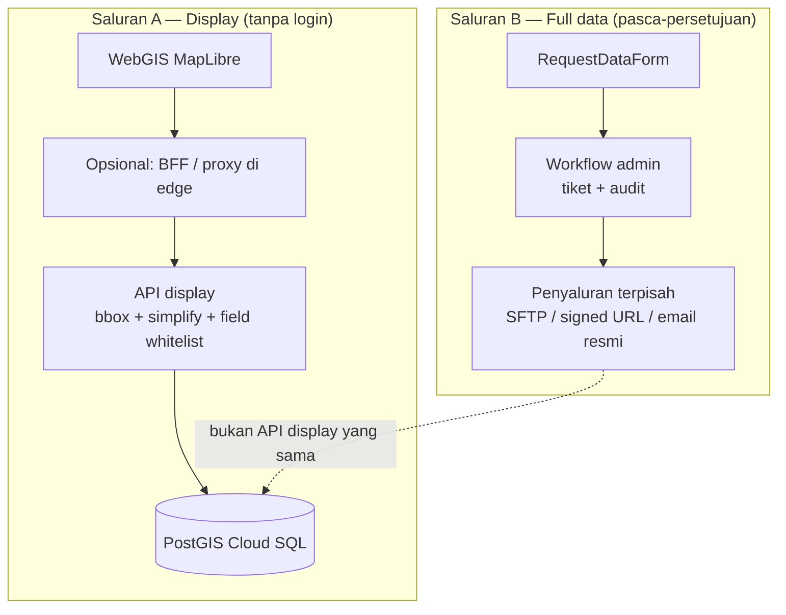

# Data Access & Security Plan — S-121 WebGIS

> **Status**: Phase 1–2 implemented; Phase 3 submit API (2026-05-26); MVT draft — lihat **`docs/MVT_MIGRATION_PLAN.md`**  
> **Last updated**: 2026-05-26  
> **Audience**: Tim pengembangan, operator deployment (BIG / PUSHIDROSAL / institusi pemilik data)  
> **Terkait**: `docs/API_REFERENCE.md`, `docs/INTEGRATION_PLAN.md`, `docs/DEPLOYMENT_RUNBOOK.md`, `src/pages/RequestDataPage.tsx`

---

## 1. Ringkasan eksekutif

WebGIS S-121 ditujukan untuk **eksplorasi visual tanpa login**. Akses ke **database utuh / paket data resmi** hanya melalui **permintaan kelembagaan** (`/request-data`).

**Masalah saat ini:** kebijakan bisnis dan implementasi teknis **tidak selaras**. API publik (`/api/limits`, `/api/locations`, dll.) mengembalikan **GeoJSON presisi penuh** yang sama-sama bisa disalin dari DevTools atau `curl` — sehingga form permintaan hanya mengatur **niat**, bukan **batas akses**.

**Tujuan rencana ini:** mendefinisikan arsitektur **dua saluran** (display vs full delivery), roadmap implementasi, dan kriteria selesai — **tanpa** mengembalikan login wajib untuk pengunjung WebGIS.

---

## 2. Keputusan produk (sumber kebenaran)


| Keputusan                                                                                        | Status                                           | Catatan                                                                           |
| ------------------------------------------------------------------------------------------------ | ------------------------------------------------ | --------------------------------------------------------------------------------- |
| Siapapun boleh membuka WebGIS **tanpa login**                                                    | ✅ Berlaku                                        | `useAuth.ts` dihapus (Phase 1)                                                    |
| Data “utuh” (dump tabel, paket resmi, relasi lengkap) hanya setelah **permintaan + persetujuan** | ✅ Berlaku                                        | `RequestDataPage` + `RequestDataForm`                                             |
| Production di lingkungan institusi (mis. BIG / PUSHIDROSAL) — data **confidential**              | ✅ Berlaku                                        | Bukan portal open data generik                                                    |
| GeoServer / OGC (WMS, WFS, …)                                                                    | Opsional, fase belakang                          | Hanya jika mitra B2G butuh interoperabilitas; **bukan** saluran publik tanpa auth |
| Hosting                                                                                          | **GCP** (Cloud SQL, Cloud Run, Firebase Hosting) | Dokumen lama yang menyebut VPS **tidak lagi menjadi acuan deployment**            |


---

## 3. Kondisi saat ini (as-is)

### 3.1 Frontend

- `fetchAllLayers()` di `src/lib/apiClient.ts` memuat **seluruh layer inti** sekaligus (tanpa `bbox`).
- Popup detail memanggil `GET /api/limits/:fuid` atau `GET /api/locations/:fuid` (geometri + atribut + relasi tambahan).
- `src/store/useAuth.ts` — scaffold `public` / `authenticated` + `mockLogin`; **tidak di-import** komponen peta mana pun.

### 3.2 Backend

- Semua route di `backend/app.js` **tanpa autentikasi**.
- Proteksi: Helmet, CORS (allow-all jika `CORS_ORIGINS` kosong), rate limit global (~120 req/menit), cache HTTP 300s pada spatial routes.
- Spatial response: `ST_AsGeoJSON` dengan atribut lengkap (`fuID`, `label`, `status`, `horizontal_datum`, `source_ids`, …).
- Endpoint metadata juga terbuka: `/api/curves`, `/api/baselines`, `/api/sources`, `/api/parties`, `/api/baunits`, `/api/rrr` — meskipun WebGIS tidak memanggil semuanya, URL production dapat diakses langsung.

### 3.3 Portal permintaan data

- `RequestDataPage` mengumpulkan identitas pemohon, institusi, keperluan, surat institusi.
- Submit form → navigasi sukses (frontend); **belum** ada workflow backend (tiket, status, persetujuan, unduhan).

### 3.4 Risiko yang disepakati tim


| Risiko                                      | Tingkat           | Penjelasan                                                          |
| ------------------------------------------- | ----------------- | ------------------------------------------------------------------- |
| Scraping GeoJSON penuh via Network / script | **Tinggi**        | Satu `GET /api/limits?type=EEZ` ≈ seluruh layer EEZ presisi         |
| CORS dianggap “aman”                        | **Salah kaprah**  | CORS hanya membatasi browser cross-origin; `curl` tidak terpengaruh |
| “Request data” = kontrol akses              | **Tinggi**        | Tanpa pemisahan API, kebijakan tidak terenforce                     |
| Endpoint metadata terbuka                   | **Sedang–tinggi** | Eksposur lebih luas dari apa yang ditampilkan di peta               |
| `useAuth` membingungkan                     | **Rendah**        | Dokumen/kode legacy vs keputusan produk                             |


---

## 4. Target arsitektur (to-be)

### 4.1 Dua saluran data




**Prinsip:** apa yang terlihat di tab Network untuk peta **bukan** definisi “database utuh”. Database utuh disalurkan **di luar** endpoint display publik.

### 4.2 Profil API `display` (saluran A)

Karakteristik yang **wajib** di-enforce di server (bukan hanya UI):


| Aspek           | Kebijakan display                                                                                                                  |
| --------------- | ---------------------------------------------------------------------------------------------------------------------------------- |
| Geometri        | `ST_SimplifyPreserveTopology` default + `ST_ReducePrecision` (mis. 4–5 desimal derajat, disepakati tim)                            |
| Cakupan spasial | `**bbox` wajib** untuk koleksi; tolak request tanpa bbox kecuali tile endpoint                                                     |
| Atribut         | Whitelist: mis. `fuid`, `label`, `limit_object_type` / `location_type_list`, `status` — **tanpa** kolom sensitif tambahan jika ada |
| Detail fitur    | Versi ringkas; relasi berat (semua vertex, semua source rows) hanya ringkasan atau tidak disertakan                                |
| Metadata routes | **Tidak** diekspos di URL publik, atau hanya subset read-only non-spasial                                                          |
| Rate limit      | Lebih ketat per IP pada spatial; pertimbangkan quota harian                                                                        |
| Audit           | Log akses: IP, route, bbox, jumlah fitur                                                                                           |


### 4.3 Penyaluran full data (saluran B)


| Metode                                                                       | Kapan dipakai                                              |
| ---------------------------------------------------------------------------- | ---------------------------------------------------------- |
| Paket file (GPKG/SHP/GeoJSON + PDF metadata) via **signed URL sekali pakai** | Pemohon disetujui                                          |
| Akses SFTP / drive institusi                                                 | Mitra pemerintah                                           |
| Akun teknis + VPN / IP allowlist + API **internal**                          | Integrasi B2G (opsional GeoServer/WFS di belakang gateway) |


**Tidak** menggunakan: “setelah approve, beri JWT yang sama ke `/api/limits` tanpa simplify” di URL publik — itu mengulangi masalah sekarang.

### 4.4 Apa yang **tidak** bisa dijamin (tanpa login)

Browser **harus** menerima geometri untuk menggambar peta. Yang realistis:

- Menurunkan **presisi** dan **kelengkapan** di saluran display.
- Menyulitkan **scraping massal** (bbox, rate limit, tidak load seluruh NKRI sekali jalan).
- Menyimpan **nilai hukum / operasional penuh** untuk saluran B.

Klaim “koordinat tidak bisa disalin” **tidak realistis** untuk WebGIS publik — fokus pada **pembatasan nilai data** dan **pemisahan saluran**.

### 4.5 Posisi GeoServer / OGC

- **Bukan** syarat untuk menutup celah display saat ini.
- Jika diadopsi nanti: hanya di jaringan / gateway institusi; WFS full fidelity **tidak** di host yang sama dengan WebGIS publik tanpa auth.
- OGC API Features / MVT dengan generalisasi boleh menjadi **implementasi** saluran display — tetap dengan aturan bbox + precision.

---

## 5. Perubahan komponen (ringkas)

### 5.1 Backend


| Item                        | Tindakan                                                                    |
| --------------------------- | --------------------------------------------------------------------------- |
| Route spatial publik        | Tambah profil `display` (default) vs `internal` (non-publik / tidak deploy) |
| Query                       | Default simplify + reduce precision; `bbox` required untuk `GET` koleksi    |
| Detail `/:fuid`             | Response ringkas; endpoint “full detail” hanya internal                     |
| Metadata (`/api/curves`, …) | Cabut dari deployment publik atau auth gateway                              |
| Env                         | Wajibkan `CORS_ORIGINS` di production; dokumentasikan                       |
| Logging                     | Structured log untuk deteksi scraping                                       |


### 5.2 Frontend


| Item           | Tindakan                                                                               |
| -------------- | -------------------------------------------------------------------------------------- |
| `apiClient.ts` | Load layer **per viewport** (`bbox` dari `map.getBounds()`), debounce on moveend       |
| Hapus / arsip  | `useAuth.ts` dan referensi WFS/login di komentar                                       |
| Popup detail   | Konsumsi endpoint display ringkas                                                      |
| UX             | Copy teks kebijakan: “Koordinat di peta digeneralisasi; data resmi melalui permintaan” |


### 5.3 Portal & workflow


| Item                 | Tindakan                                                  |
| -------------------- | --------------------------------------------------------- |
| `RequestDataForm`    | `POST /api/data-requests` → simpan ke DB / email operator |
| Admin (fase berikut) | Panel status: pending / approved / rejected               |
| Delivery             | Generate paket + signed URL; **audit** siapa unduh kapan  |


### 5.4 Dokumentasi & legacy


| Dokumen                         | Tindakan                                                      |
| ------------------------------- | ------------------------------------------------------------- |
| `docs/architecture-overview.md` | Tambah pointer ke dokumen ini; hapus asumsi login WFS publik  |
| `docs/rencana.md`               | Tandai bagian VPS / auth lama sebagai historical              |
| `docs/API_REFERENCE.md`         | Pisahkan “Public display API” vs “Internal (tidak dipublish)” |
| `useAuth.ts`                    | Hapus setelah fase 1 frontend cleanup                         |


---

## 6. Roadmap implementasi

### Phase 0 — Keselarasan & dokumentasi (½ hari)

- Review tim: setujui prinsip dua saluran + precision default
- Tetapkan presisi display (contoh: 0.0001° ≈ ~11 m di ekuator — nilai final oleh ahli data)
- Tetapkan field whitelist display
- Tandai `useAuth` deprecated di README dev

**Deliverable:** dokumen ini disetujui stakeholder teknis.

---

### Phase 1 — Tutup celah paling kritis — ✅ (kode, 2026-05-26)

**Backend**

- [x] `GET /api/limits` & `/api/locations`: **bbox wajib** (`REQUIRE_BBOX`, default true)
- [x] `ST_SimplifyPreserveTopology` + `ST_ReducePrecision` default
- [x] Atribut koleksi disesuaikan UI; detail disederhanakan
- [x] Metadata routes: `ENABLE_METADATA_API=false` (default)
- [ ] Production: `CORS_ORIGINS` di Cloud Run

**Frontend**

- [x] Fetch dengan bbox (sekali saat init, extent Indonesia — tanpa refetch tiap geser peta)
- [x] `useAuth.ts` dihapus

**Deploy**

- [ ] Redeploy backend + frontend

**Acceptance criteria Phase 1**

1. `curl` tanpa `bbox` ke koleksi spatial → `400 BBOX_REQUIRED`
2. Respons GeoJSON koordinat terlihat dibulatkan vs database mentah
3. Metadata routes tidak reachable dari URL production publik
4. WebGIS tetap berfungsi tanpa login

---

### Phase 2 — Display hardening — ✅ (kode, 2026-05-26)

- [x] Detail: cap sumber (`DISPLAY_DETAIL_MAX_SOURCES`), parent limits cap 20, vertices kosong
- [x] Rate limit spatial (`RATE_LIMIT_SPATIAL_MAX`) + standard `Retry-After` headers
- [x] Audit log `spatial_access` via `backend/lib/spatialAudit.js`
- [ ] BFF/proxy (opsional, backlog)
- [x] ~~Banner kebijakan di UI~~ (tidak dipakai — kebijakan hanya di portal/form bawaan)

**Acceptance criteria Phase 2**

1. Scraping seluruh NKRI membutuhkan ribuan request bbox (tercatat log)
2. Popup detail tidak mengembalikan data setara export DB

---

### Phase 3 — Workflow permintaan data — 🔄 sebagian

- [x] SQL: `backend/migrations/002_data_requests.sql`
- [x] `POST /api/data-requests` + multer upload + rate limit submit
- [x] Form portal terhubung API (`submitDataRequest.ts`)
- [x] Migrasi `002` di Cloud SQL (operator)
- [ ] `REQUEST_UPLOAD_DIR` atau GCS untuk file surat di production
- [x] Webhook opsional `DATA_REQUEST_NOTIFY_WEBHOOK_URL`
- [x] Admin API: list / detail / PATCH approve|reject (`DATA_REQUEST_ADMIN_KEY` + `X-Admin-Key`)
- [ ] UI admin + generate paket unduhan + signed URL

**Acceptance criteria Phase 3**

1. Alur end-to-end: submit form → admin approve → pemohon unduh paket
2. Paket full fidelity **tidak** pernah dihasilkan oleh endpoint yang dipanggil WebGIS

---

### Phase 4 — Opsional interoperabilitas B2G (backlog)

- GeoServer di GCP (bukan VPS) hanya jaringan institusi
- WFS/WMS dengan auth gateway untuk mitra yang sudah disetujui
- OGC API Features sebagai alternatif implementasi saluran display (MVT)

---

## 7. Matriks endpoint (target)


| Endpoint                             | Publik display                | Internal / pasca-approve |
| ------------------------------------ | ----------------------------- | ------------------------ |
| `GET /api/limits` (koleksi)          | ✅ bbox + simplify + whitelist | Full (VPN only)          |
| `GET /api/limits/:fuid`              | ✅ ringkas                     | Full                     |
| `GET /api/locations` (koleksi)       | ✅ bbox + simplify + whitelist | Full                     |
| `GET /api/locations/:fuid`           | ✅ ringkas                     | Full                     |
| `GET /api/health`                    | ✅                             | ✅                        |
| `GET /api/curves`, `/api/sources`, … | ❌ tidak publik                | ✅                        |
| `POST /api/data-requests`            | ✅ (submit only)               | —                        |
| Unduhan paket                        | ❌                             | ✅ signed URL             |


---

## 8. Konfigurasi lingkungan (usulan)

```env
# Production Cloud Run
CORS_ORIGINS=https://project1-seaboundaries.web.app,https://<domain-institusi>
DISPLAY_PRECISION_DECIMALS=4
DISPLAY_SIMPLIFY_TOLERANCE=0.0005
REQUIRE_BBOX=true
ENABLE_METADATA_API=false
RATE_LIMIT_SPATIAL_MAX=30
RATE_LIMIT_WINDOW_MS=60000
```

---

## 9. Uji keamanan manual (checklist)

- Buka WebGIS → Network: tidak ada response single-file seluruh layer EEZ/TS tanpa bbox
- `curl -s "$API/api/limits?type=EEZ"` → harus gagal (400) tanpa bbox
- `curl` dengan bbox besar → jumlah koordinat / presisi sesuai policy
- Akses `/api/sources` dari internet → 404 atau 403 di production
- Salin URL API ke Postman dari luar origin → CORS tidak relevan; pastikan rate limit aktif
- Submit form permintaan → tercatat; belum ada unduhan full sampai approve (Phase 3)

---

## 10. Non-goals (eksplisit)

- Login wajib untuk melihat peta (bertentangan dengan keputusan produk).
- DRM / enkripsi geometri di browser (tidak efektif untuk vektor).
- Mengandalkan GeoServer saja tanpa bbox/precision untuk “aman”.
- Menyimpan `useAuth` mock sebagai “security”.

---

## 11. Referensi kode


| Area                | Path                                                                         |
| ------------------- | ---------------------------------------------------------------------------- |
| Fetch layer penuh   | `src/lib/apiClient.ts` — `fetchAllLayers()`                                  |
| Auth legacy         | `src/store/useAuth.ts`                                                       |
| Form permintaan     | `src/components/portal/RequestDataForm.tsx`, `src/pages/RequestDataPage.tsx` |
| Route tanpa auth    | `backend/app.js`                                                             |
| Spatial queries     | `backend/routes/limits.js`, `backend/routes/locations.js`                    |
| Security middleware | `backend/lib/security.js`                                                    |
| Bbox helper         | `backend/lib/queryHelpers.js`                                                |


---

## 12. Riwayat revisi


| Tanggal    | Perubahan                                                      |
| ---------- | -------------------------------------------------------------- |
| 2026-05-26 | Draft awal — dua saluran, tanpa login, tutup celah API display |


