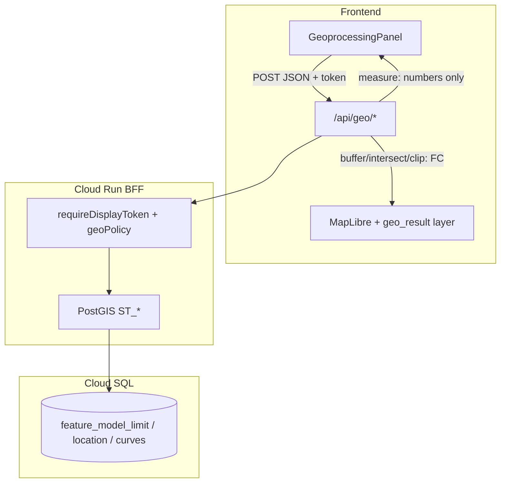

# Geoprocessing Implementation Plan

> **Status**: Implemented (v1); Phase 4 hardening ongoing  
> **Last updated**: 2026-05-31  
> **Scope**: Panjang, luas, buffer, intersect, clip (server-side PostGIS via BFF)  
> **Related**: `docs/DATA_ACCESS_SECURITY_PLAN.md`, `docs/API_REFERENCE.md`, `docs/wms-wfs-wps-overview.md`, `src/components/GeoprocessingPanel.tsx`

---

## 1. Goals

| Goal | Description |
|------|-------------|
| **Domain fit** | Operasi yang relevan untuk batas maritim: ukur garis/poligon, buffer analitis, irisan dan potong antar layer. |
| **Server-side** | Komputasi di PostGIS (Cloud SQL), bukan Turf.js di browser — konsisten dengan saluran display MVT. |
| **Keamanan display** | Bukan “anti-inspect”, tetapi batasi scraping massal: bbox, token, presisi, audit log. |
| **UX** | Panel geoprocessing selaras Filter (Limit/Point), hasil geometri tampil sebagai **layer sementara** di peta. |
| **TA / demo** | Dapat diuji otomatis + dijelaskan di laporan sebagai analisis spasial terkontrol. |

### Out of scope (v1)

- GeoServer **WPS** (boleh fase berikutnya; arsitektur BFF PostGIS cukup untuk capstone).
- Union, difference, convex hull, centroid, bbox, simplify di UI (hapus dari dropdown).
- Export SHP/GPKG hasil geoprocessing (saluran institusional tetap `/request-data`).
- Geoprocessing tanpa batas (seluruh NKRI sekali request).

---

## 2. Current state

| Area | Today |
|------|--------|
| **UI** | `GeoprocessingPanel.tsx` — 10 operasi Turf.js; hanya teks hasil, **tidak** layer hasil di peta. |
| **Data** | MVT mode: geometri penuh di store hanya untuk **viewport** (`refreshActiveLayerAttributes`). |
| **Backend** | Tidak ada route `/api/geo/*`. |
| **Security** | `X-Display-Token`, bbox cap, simplify — sudah untuk `/api/limits`, `/api/locations`, tiles. |

**Implikasi**: Client-side geoprocessing pada data nasional **tidak andal** di MVT. Semua operasi v1 harus **ID + bbox + parameter** ke server, bukan mengirim GeoJSON besar dari browser.

---

## 3. Architecture



**Keputusan**: Implementasi **BFF + PostGIS** (sama stack dengan tile), bukan WPS GeoServer di v1 — lebih sedikit moving parts, reuse `queryHelpers`, `displayConfig`, audit.

WPS tetap opsi fase 2 jika institusi sudah punya GeoServer standar.

---

## 4. Security model (realistic)

| Klaim | Realitas |
|-------|----------|
| Server-side menyembunyikan data | **Tidak** untuk operasi yang mengembalikan geometri (buffer, intersect, clip) — respons terlihat di Network. |
| Lebih aman dari Turf + GeoJSON penuh | **Ya** — tidak mengirim/memproses seluruh layer di client; bbox + max fitur + simplify hasil. |
| Token = login | **Tidak** — token sesi display (`GET /api/display/session`); siapa pun buka WebGIS dapat token. |
| Panjang/luas paling “rapi” | **Ya** — respons **hanya angka** + metadata, tanpa GeoJSON hasil. |

### Enforce di server (wajib)

| Control | Default | Env (proposal) |
|---------|---------|----------------|
| Display token | Required (MVT mode) | `DISPLAY_REQUIRE_TOKEN` (existing) |
| Bbox wajib | **No** (v2; optional) | omitted = whole layer + `GEO_MAX_FEATURES` |
| Max bbox area (geo) | **5 deg²** (lebih ketat dari koleksi 25) | `GEO_MAX_BBOX_AREA_DEG2=5` |
| Max input features | 50 | `GEO_MAX_FEATURES=50` |
| Max buffer distance | 500 km | `GEO_MAX_BUFFER_KM=500` |
| Hasil geometri | Simplify + `ST_ReducePrecision` | reuse `DISPLAY_SIMPLIFY_TOLERANCE`, `DISPLAY_PRECISION_DECIMALS` |
| Max features in response | 100 | `GEO_MAX_OUTPUT_FEATURES=100` |
| Audit log | Setiap POST geo | extend `spatialAuditLogger` → `/api/geo` |

### Input contract (prinsip)

- Client mengirim **`layerId`** (core layer), **`fuids[]`** (opsional, dari seleksi peta), **`bbox`**, parameter operasi.
- Server **resolve geometri dari DB** — jangan terima GeoJSON arbitrer dari client (kecuali `user_layer` fase 2).
- Jika `fuids` kosong → proses fitur dalam bbox yang memenuhi filter layer (dengan cap `GEO_MAX_FEATURES`).

---

## 5. Operations specification

### 5.1 Measure — length (`length`)

| Item | Spec |
|------|------|
| **Input layers** | Garis: `baseline`, limit lines (`territorial_sea`, …), atau subset via `type` API. |
| **PostGIS** | `ST_Length(ST_Transform(geom, 3857))` atau geography untuk km. |
| **Response** | `{ operation: "length", unit: "km", value: number, featureCount: number }` |
| **Geometry in response** | **None** |

### 5.2 Measure — area (`area`)

| Item | Spec |
|------|------|
| **Input layers** | Poligon limit: `territorial_sea`, `eez_limit`, `fisheries`, dll. |
| **PostGIS** | `ST_Area(ST_Transform(geom, 3857)) / 1e6` → km². |
| **Response** | `{ operation: "area", unit: "km2", value: number, featureCount: number }` |
| **Geometry in response** | **None** |

### 5.3 Buffer (`buffer`)

| Item | Spec |
|------|------|
| **Input** | Line atau polygon (satu layer), `distanceKm`, optional `fuids`, `bbox`. |
| **PostGIS** | `ST_Buffer(geom::geography, distance_m)::geometry` atau `ST_Transform` pipeline. |
| **Response** | `FeatureCollection` (hasil saja, disederhanakan), `properties: { operation, distanceKm, sourceFuid }`. |
| **UI** | Layer sementara `geo_result` (fill/line semi-transparan), tombol “Hapus hasil”. |

### 5.4 Intersect (`intersect`)

| Item | Spec |
|------|------|
| **Input** | `layerA`, `layerB` (core IDs), `bbox`, optional `fuidsA` / `fuidsB`. |
| **PostGIS** | `ST_Intersection(a.geom, b.geom)` + `ST_MakeValid` jika perlu. |
| **Use case** | Tumpang tindih ZEE × perikanan, garis × zona, dll. |
| **Response** | `FeatureCollection` (irisan saja), cap output features. |

### 5.5 Clip (`clip`)

| Item | Spec |
|------|------|
| **Input** | `layer` (yang dipotong), `clipBy`: `"bbox"` \| `"layer"`, `clipLayer` jika layer, `bbox`. |
| **PostGIS** | `ST_Intersection(geom, clipGeom)` — clipGeom dari envelope bbox atau union bbox layer B. |
| **Bed vs intersect** | **Clip** = potong satu layer oleh mask (bbox/layer); **Intersect** = irisan dua layer setara. |
| **Response** | Sama seperti intersect (geometri hasil). |

---

## 6. API design

Base path: **`/api/geo`** — semua `POST`, `Content-Type: application/json`, header **`X-Display-Token`**.

### 6.1 `POST /api/geo/measure`

**Request**

```json
{
  "operation": "length",
  "layerId": "baseline",
  "bbox": "95.0,-6.0,96.0,-5.0",
  "fuids": ["LIM_BSL_..."]
}
```

`operation`: `"length"` | `"area"`.

**Response 200**

```json
{
  "operation": "length",
  "unit": "km",
  "value": 412.38,
  "featureCount": 3
}
```

**Errors**: `BBOX_REQUIRED`, `BBOX_TOO_LARGE`, `GEO_TOO_MANY_FEATURES`, `GEO_UNSUPPORTED_LAYER`, `GEO_NO_FEATURES`.

### 6.2 `POST /api/geo/buffer`

**Request**

```json
{
  "layerId": "eez_limit",
  "distanceKm": 12,
  "bbox": "95.0,-6.0,96.0,-5.0",
  "fuids": []
}
```

**Response 200**

```json
{
  "type": "FeatureCollection",
  "features": [ ... ],
  "meta": {
    "operation": "buffer",
    "distanceKm": 12,
    "inputCount": 2,
    "outputCount": 2,
    "simplified": true
  }
}
```

### 6.3 `POST /api/geo/intersect`

**Request**

```json
{
  "layerA": "eez_limit",
  "layerB": "fisheries",
  "bbox": "95.0,-6.0,96.0,-5.0",
  "fuidsA": [],
  "fuidsB": []
}
```

### 6.4 `POST /api/geo/clip`

**Request**

```json
{
  "layerId": "territorial_sea",
  "clipBy": "bbox",
  "bbox": "95.0,-6.0,96.0,-5.0",
  "fuids": []
}
```

atau `"clipBy": "layer", "clipLayerId": "fisheries"`.

### 6.5 Layer ID → SQL mapping

Reuse mapping dari `src/lib/apiClient.ts` `LAYER_API_CONFIG` (limit type / location type). Backend module baru: `backend/lib/geoLayerResolve.js` — maps `layerId` → SQL `WHERE` + join curves/baselines (sama pola `limits.js` / `locations.js`).

---

## 7. Backend implementation tasks

| # | Task | Files (proposal) |
|---|------|------------------|
| B1 | `geoPolicy.js` — parse bbox, validate area, max features, buffer km | `backend/lib/geoPolicy.js` |
| B2 | `geoLayerResolve.js` — CTE geometri per `layerId` + fuid filter | `backend/lib/geoLayerResolve.js` |
| B3 | `geoSql.js` — measure, buffer, intersect, clip queries | `backend/lib/geoSql.js` |
| B4 | Route `routes/geo.js` — 4 endpoints, set `res.locals.spatialFeatureCount` | `backend/routes/geo.js` |
| B5 | Register router di `app.js` dengan `requireDisplayToken` | `backend/app.js` |
| B6 | Extend `spatialAuditLogger` for `/api/geo` | `backend/lib/spatialAudit.js` |
| B7 | Env docs + defaults in `displayConfig.js` or dedicated `geoConfig.js` | `backend/lib/geoConfig.js` |
| B8 | Tests: happy path, bbox too large, no features, token 401 | `backend/test/geo.test.js` |

**Note**: Gunakan transaksi read-only; timeout query (statement_timeout) disarankan untuk Cloud SQL.

---

## 8. Frontend implementation tasks

| # | Task | Files (proposal) |
|---|------|------------------|
| F1 | `src/lib/geoApi.ts` — `measure`, `buffer`, `intersect`, `clip` wrappers | new |
| F2 | Slim `GeoprocessingPanel` — 5 ops only; hapus Turf untuk core layers | `GeoprocessingPanel.tsx` |
| F3 | Bbox dari **map viewport** (`map.getBounds()`) otomatis setiap run | hook `useMapBbox` atau dari `Map.tsx` context |
| F4 | Kirim `selectionIds` → `fuids` bila ada seleksi | panel + store |
| F5 | **Result layer** `geo_result` — source/layer di Map, toggle di Layer panel | `src/components/map/geoResultLayer.ts`, store |
| F6 | UI: km / km² hasil; loading/error states; hapus banner WPS lama | `webgis-messages.ts`, panel |
| F7 | Mode MVT: tidak bergantung `layers[].data` penuh — selalu panggil API geo | panel logic |
| F8 | i18n ID/EN untuk 5 operasi + pesan error geo | `webgis-messages.ts` |

### UI flow (target)

1. User pilih operasi → layer (dan layer kedua jika perlu).
2. Opsional: pilih fitur di peta (orange selection) → hanya `fuids` tersebut.
3. Parameter (km buffer) jika perlu.
4. **Jalankan** → POST dengan bbox viewport.
5. **Measure** → angka di panel. **Buffer/intersect/clip** → gambar `geo_result` + ringkasan count.

---

## 9. Phased rollout

### Phase 1 — Foundation (backend + measure)

- [ ] B1–B8 measure endpoints only (`length`, `area`)
- [ ] F1, F3, F4, F6 — panel memanggil API measure
- [ ] Update `API_REFERENCE.md`
- [ ] **Deliverable**: Panjang/luas akurat dari PostGIS; Network hanya JSON angka.

**Estimasi**: 2–3 hari dev + test.

### Phase 2 — Buffer + result layer

- [ ] Buffer endpoint + simplify output
- [ ] F5, F2 buffer UI, clear result button
- [ ] **Deliverable**: Buffer tampil di peta, terbatas bbox.

**Estimasi**: 2–3 hari.

### Phase 3 — Intersect & clip

- [ ] Intersect + clip endpoints
- [ ] UI second layer / clip mode
- [ ] **Deliverable**: Analisis tumpang tindih dua layer dalam viewport.

**Estimasi**: 3–4 hari.

### Phase 4 — Hardening & TA

- [ ] Remove dead Turf ops + update CHANGELOG / SPEAKER_NOTES
- [ ] Manual test matrix (below)
- [ ] Laporan TA: subbab keamanan display + geoprocessing terbatas

**Estimasi**: 1–2 hari.

**Total rough**: ~8–12 hari kerja (termasung uji di Cloud Run).

---

## 10. Test plan

### Automated (`backend/test/geo.test.js`)

| Case | Expect |
|------|--------|
| No token (MVT on) | 401 |
| Missing bbox | 400 `BBOX_REQUIRED` |
| Bbox > GEO_MAX area | 400 `BBOX_TOO_LARGE` |
| Measure length baseline | 200, `value >= 0` |
| Measure area EEZ | 200, `unit === 'km2'` |
| Buffer 10 km | 200, `features.length <= GEO_MAX_OUTPUT` |
| Intersect two layers empty bbox ocean | 200, `featureCount === 0` ok |

### Manual (browser)

| # | Steps | Pass |
|---|--------|------|
| M1 | Pilih 1 garis → length → angka masuk akal | |
| M2 | Pilih poligon → area → km² | |
| M3 | Buffer 12 km → poligon muncul, hapus hasil hilang | |
| M4 | Intersect EEZ + fisheries di area sempit | |
| M5 | Clip TS by bbox kecil | |
| M6 | Network: measure tidak ada FeatureCollection besar | |
| M7 | Zoom out besar → request ditolak (bbox too large) | |

---

## 11. Documentation updates

| Document | Update |
|----------|--------|
| `docs/API_REFERENCE.md` | Section `/api/geo/*` |
| `docs/DATA_ACCESS_SECURITY_PLAN.md` | Subsection geoprocessing display channel |
| `SPEAKER_NOTES.md` | Ganti “Turf.js” → “PostGIS BFF, hasil terbatas viewport” |
| `CHANGELOG.md` | Entry per phase |
| `.env.example` / `backend/.env.example` | `GEO_*` variables |

---

## 12. Open decisions (confirm before Phase 1)

| # | Question | Recommendation |
|---|----------|----------------|
| D1 | Buffer distance unit | **km** (UI); server convert to meters for geography |
| D2 | Allow run without selection (all in bbox)? | **Yes**, with `GEO_MAX_FEATURES` cap |
| D3 | `user_layer` in v1? | **No** — Phase 2+ or client Turf only for upload |
| D4 | Separate geo bbox cap (5 deg²) vs display (25)? | **Yes** — stricter for analysis |
| D5 | Rate limit POST `/api/geo`? | Optional low limit (e.g. 30/min/IP) if abuse seen |

---

## 13. Success criteria

- [ ] Hanya **5 operasi** di panel: length, area, buffer, intersect, clip.
- [ ] Core layers di MVT mode **tanpa** Turf pada data nasional.
- [ ] Measure **tidak** mengembalikan geometri.
- [ ] Buffer/intersect/clip mengembalikan geometri **tergeneralisasi** + dibatasi bbox.
- [ ] Semua endpoint geo memerlukan **display token** (production).
- [ ] ≥ 8 automated backend tests hijau.
- [ ] Manual matrix M1–M7 lulus di staging/production.

---

## 14. References

- Existing panel: `src/components/GeoprocessingPanel.tsx`
- Display security: `docs/Laporan_TA/LAPORAN_IMPLEMENTASI_KEAMANAN_AKSES_DATA_DAN_MVT.md`
- WPS future option: `docs/wms-wfs-wps-overview.md`, `docs/rencana.md`
- Filter pattern (viewport, API): `src/components/panels/FilterPanel.tsx`
