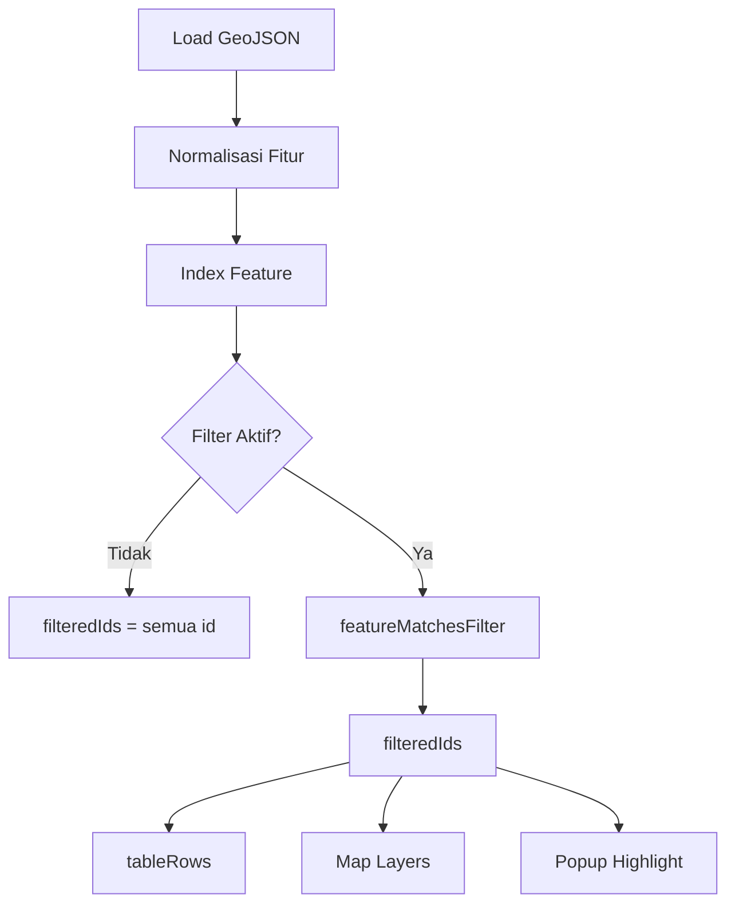

# Ringkasan Algoritma Kerja Aplikasi Web

Dokumen ini menjelaskan alur kerja tingkat tinggi aplikasi **Sea Boundaries** sejak pemuatan awal sampai interaksi utama pengguna. Fokusnya adalah bagaimana data dipersiapkan, dikelola, dan divisualisasikan pada UI.

## 1. Struktur Komponen Utama

- **Vite + React** menjadi fondasi render antarmuka.
- **Zustand store (`useLayersStore`, `useUIStore`)** menyimpan status global seperti layer aktif, filter, seleksi, dan preferensi UI.
- **MapLibre (`Map.tsx`)** menangani render peta, sinkronisasi sorotan (hover/selection), popup, dan zoom.
- **Sidebar modular** menampung Query Builder, Attribute Table, Legend, Layer Toggle, dan panel layer pengguna.

## 2. Alur Inisialisasi Aplikasi

1. `App.tsx` memuat TopBar, Sidebar, dan Map setelah memanggil `loadInitialFilters()` dari `useLayersStore`.
2. `loadLayerCollections()` (di `lib/dataLoader.ts`) menarik data GeoJSON statis dari direktori `src/data` dan menyiapkannya sebagai `FeatureCollection`.
3. `initialiseLayers()` membangun `LayerRuntimeState` untuk setiap layer dasar:
    - Membuat indeks fitur (`featureIndex`) agar akses cepat berdasarkan ID.
    - Menyiapkan daftar fitur terfilter (`filteredIds`) awal berdasarkan filter tersimpan di `localStorage` (jika ada).
    - Menghitung properti layer seperti `renderKind`, `geometryType`, status visibilitas, dll.
4. `createInitialCache()` membuat cache nilai unik per field untuk Query Builder.
5. Store menyetel layer aktif default (`batas_maritim`) dan membangun baris tabel awal (`buildTableRows`).

## 3. Siklus Hidup Data GeoJSON

1. GeoJSON mentah dinormalisasi menjadi `FeatureWithProps` melalui `lib/schema.ts` dan `lib/userLayer.ts` (untuk layer pengguna). Normalisasi menambahkan kunci `__fid` dan memastikan `feature.id` unik.
2. `featureIndex` memetakan `feature.id` ke objek fitur untuk lookup cepat.
3. Ketika filter aktif, `featureMatchesFilter()` menentukan fitur mana yang lolos; hasilnya membentuk `filteredIds`.
4. `filteredIds` digunakan oleh:
    - **Attribute Table**: `buildTableRows()` mengambil properti berdasarkan daftar ID ini.
    - **Map**: menyusun filter MapLibre sehingga layer "filtered"/"selection" hanya merender ID yang sama.
    - **Popup**: `getFeatureById()` mencari fitur saat pengguna mengklik peta atau tabel.

## 4. Interaksi Pengguna & Reaksi Sistem

| Aksi Pengguna               | Dampak di Store                      | Pembaruan UI                                                                                   |
| --------------------------- | ------------------------------------ | ---------------------------------------------------------------------------------------------- |
| Menyalakan/ mematikan layer | `setLayerVisibility`                 | Layer MapLibre di-hide/show, daftar toggle disinkronkan.                                       |
| Memilih layer aktif         | `setActiveLayer`                     | Attribute Table dan Query Builder memuat skema & data layer baru.                              |
| Hover/klik fitur di peta    | `setHoveredFeature` / `setSelection` | Map mengganti layer highlight, tabel menggulir & menyorot baris yang sama.                     |
| Zoom via tombol/fitur       | `requestZoomToIds`→`pendingZoom`     | Map memanggil `map.fitBounds` atau `flyTo` untuk ID yang diminta.                              |
| Mengimpor GeoJSON pengguna  | `parseUserGeoJson` → `setUserLayer`  | Skema layer pengguna dibuat, map & tabel diperbarui, Query Builder dapat mengakses field baru. |

## 5. Sinkronisasi Peta dan Sidebar

- **Map** memanfaatkan `mapLayerConfigs` untuk membuat empat lapisan per layer: `base`, `filtered`, `selection`, `hover`.
- Store memancarkan `filterExpression`, `selectionIds`, `hoveredId`, dan `visible` ke Map melalui hooks.
- Map mengikat event `mousemove`, `mouseleave`, `click` untuk memanggil update store (hover/selection) dan membuka popup (`buildPopupHtml`).
- Sidebar komponen seperti `AttributeTable`, `LayerToggle`, `Legend`, `QueryBuilder` memonitor store menggunakan selectors ringan agar re-render minimal.

## 6. Manajemen Basemap & Tema

Pengaturan basemap kini terbagi per mode tema untuk menjamin pengalaman konsisten saat pengguna berpindah antara tampilan terang dan gelap.

- **Mapping per mode** — `lightBasemaps` (OSM, OpenTopoMap, Esri) dan `darkBasemaps` (Carto Dark Matter, OpenTopoMap, Esri) didefinisikan di `src/data/basemaps.ts`.
- **Sinkronisasi ID** — helper `mapBasemapId(currentId, targetTheme)` memastikan tipe basemap tetap sepadan ketika tema berubah (OSM ↔ Carto, lainnya tetap).
- **Kontrol MapLibre** — `BasemapsControl` hanya menampilkan tiga opsi yang relevan untuk tema aktif; opsi lain disembunyikan dan tidak interaktif.
- **Transisi tema** — `ensureBasemapLayers()` menyesuaikan sumber & layer raster, atau memuat style vector khusus (Carto) hanya bila diperlukan, lalu mengembalikan overlay tanpa kehilangan state.
- **Fallback aman** — jika basemap tersimpan tidak tersedia pada tema tujuan, otomatis diganti dengan default (`osm` untuk light, `darkMatter` untuk dark).

Pengetahuan ini penting saat menambahkan basemap baru atau menyesuaikan perilaku tema, karena semua logika berpangkal pada berkas `basemaps.ts` dan fungsi `ensureBasemapLayers()` di `Map.tsx`.

## 7. Persistensi & Preferensi

- Filter layer inti diserialisasi ke `localStorage` (`LAST_FILTER_KEY`).
- URL layer pengguna terakhir disimpan di `LAST_USER_URL_KEY`.
- Builder Query disimpan per layer di `useUIStore`, termasuk preset kustom.

## 8. Error Handling & Feedback

- Semua operasi pengguna kritis (import, fetch URL, apply filter) membungkus eksekusi dalam `try/catch` dan menampilkan toast.
- Map memvalidasi dukungan geometri; jika campuran geometry family ditemukan saat import, proses dibatalkan dengan pesan.

---

Gunakan dokumen ini sebagai peta mental saat menelusuri kode: mulai dari store, lihat `lib` untuk utilitas data, kemudian Map & komponen sidebar untuk interaksi UI. Dokumentasi spesifik Query dan fungsi lanjutan tersedia di `README-query.md`.
