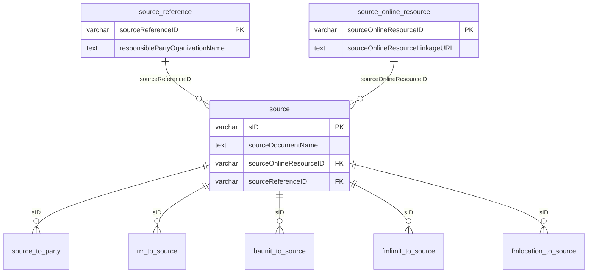

# Rencana Normalisasi Tabel `source` (S-121 Source Group)

> **Status**: Perencanaan + generator seed siap (`import_source_normalized.py`)  
> **Acuan UML**: `S121 Source::Source`, `onlineResource`, `responsibleParty` (+ contact/address)  
> **Data sumber**: `real_db_schema/Source Block - Source_Baru.csv`, `sourceOnlineResource.csv`, `sourceReference.csv`

---

## 1. Diagnosis: ketergantungan transitif pada skema lama

### Skema saat ini (`seed_source.sql`)

Satu tabel `source` (~32 kolom) mem-flatten:

| Blok UML | Kolom di `source` (contoh) |
|----------|----------------------------|
| Source (inti) | `sID`, `sourceDocumentName`, `sourceRegistryNumber`, tanggal, tipe, … |
| onlineResource | `sourceOnlineResourceLinkageURL`, `Protocol`, `Name`, … |
| responsibleParty + contact + address | `responsiblePartyOganizationName`, `ContactPhone`, `AddressCity`, … |

### Rantai transitif yang terjadi

```
sID → responsiblePartyOganizationName → (alamat, telepon, email, …)
```

Contoh nyata dari data:

| sourceReferenceID | Organisasi | Jumlah `source` yang memakai |
|-------------------|------------|------------------------------|
| `REF_002` | Government of the Republic of Indonesia | **29** |
| `REF_003` | United Nations | 14 |
| `REF_004` | Asian Maritime Index | 7 |
| `REF_001` | United Nations (Publisher) | 1 |

29 baris `source` mengulang alamat BPK/Jakarta yang sama — klasik pelanggaran **3NF** dan sumber *update anomaly*.

`sourceOnlineResource` di CSV baru tetap **1:1 per dokumen** (`SOR_*` unik per `sID`), sehingga dipisah ke tabel sendiri terutama untuk keselarasan UML dan pemisahan concern, bukan karena banyak-duplikat URL.

---

## 2. Analisis berkas CSV baru

### 2.1 `Source Block - Source_Baru.csv`

- **51 baris** (`sID` = PK logis).
- Kolom inti dokumen + **dua FK logis**:
  - `sourceOnlineResourceID` → `SOR_*`
  - `sourceReferenceID` → `REF_*`
- Validasi silang: **0 orphan** terhadap dua CSV satelit.

### 2.2 `Source Block - sourceOnlineResource.csv`

- **51 baris**, PK `sourceOnlineResourceID`.
- `sourceOnlineResourceLinkageURL` terisi untuk semua baris (wajib menurut S-121).
- Pemetaan 1:1 dengan `Source_Baru` (setiap dokumen punya SOR sendiri).

### 2.3 `Source Block - sourceReference.csv`

- **4 baris** unik — entitas `responsibleParty` yang di-share banyak dokumen.
- Contact + address masih **flatten** dalam satu baris REF (setara gabungan UML `contact` + `address`).
- Cukup untuk **3NF praktis** pada domain ini; pemecahan lagi ke `source_contact` / `source_address` opsional (Fase 2).

### 2.4 Perbedaan dengan `Source Block - Source.csv` (lama)

| Aspek | Lama | Baru |
|-------|------|------|
| Struktur | Satu lebar | Tiga entitas |
| Kolom per baris source | ~32 | 13 (+ FK) |
| Duplikasi organisasi | 51× pengulangan | 4 baris REF |
| Online resource | Embedded | Tabel `source_online_resource` |

---

## 3. Target skema relasional (rekomendasi)



**Urutan seed:**

1. `seed_source_reference.sql`
2. `seed_source_online_resource.sql`
3. `seed_source_normalized.sql`
4. (tidak berubah) `seed_source_party.sql`, junction lain yang referensi `source(sID)`

---

## 4. Drop table vs drop kolom — best practice

### Jangan: `DROP TABLE source`

Tabel `source` adalah **hub FK** untuk:

- `source_to_party`
- `baunit_to_source`
- `rrr_to_source`
- `fmlimit_to_source`
- `fmlocation_to_source`

Menjatuhkan tabel berarti migrasi ulang semua junction + risiko downtime besar.

### Rekomendasi: **migrasi in-place — buang kolom, pertahankan `sID`**

| Langkah | Aksi |
|--------|------|
| A | `CREATE TABLE` `source_reference`, `source_online_resource` |
| B | Seed dari CSV baru (script Python) |
| C | `ALTER TABLE source` tambah `sourceOnlineResourceID`, `sourceReferenceID` |
| D | Backfill FK dari tabel lama (skrip migrasi satu kali) **atau** rebuild baris `source` dari CSV jika DB dev |
| E | `ALTER TABLE source` `DROP COLUMN` untuk semua kolom flatten (online + responsibleParty*) |
| F | Tambah `FOREIGN KEY` ke REF/SOR |
| G | (Opsional) `CREATE VIEW source_flat` untuk kompatibilitas API sementara |

### Kapan rebuild penuh?

- Lingkungan **dev/staging** kosong: ganti `seed_source.sql` → tiga seed normalisasi; hapus berkas lama dari urutan eksekusi.
- **Produksi Cloud SQL**: patch bertahap (B–F), tanpa drop table.

### Fase opsional (UML penuh)

Jika penguji TA mensyaratkan pemisahan `contact` dan `address`:

- Pecah kolom `responsiblePartyContact*` dari `source_reference` → `source_contact` + `source_address`.
- Tidak wajib untuk menghilangkan transitif utama (organisasi → alamat) yang sudah terselesaikan di REF.

---

## 5. Dampak aplikasi

| Komponen | Dampak |
|----------|--------|
| `GET /api/sources` | Tetap bisa `SELECT` kolom inti dari `source`; URL bisa dari JOIN `source_online_resource` |
| `GET /api/sources/:sid` | Ganti `SELECT *` → JOIN ketiga tabel atau view `source_flat` |
| `audit_schema.js` | Tambah ekspektasi 2 tabel; `source` row count tetap 51 |
| `S121_DATABASE_SCHEMA.md` | Perbarui bagian Source Group setelah migrasi |

---

## 6. Generator seed

```powershell
cd D:\web\coba-gis\sea-boundaries
python real_db_schema/import_source_normalized.py --validate-only
python real_db_schema/import_source_normalized.py
```

Output:

- `real_db_schema/seed_source_reference.sql`
- `real_db_schema/seed_source_online_resource.sql`
- `real_db_schema/seed_source_normalized.sql`

---

## 6b. Urutan eksekusi (database produksi / dev yang sudah ada)

| Langkah | Berkas | Catatan |
|--------|--------|---------|
| **1** | `seed_source_reference.sql` | 4 baris REF |
| **2** | `seed_source_online_resource.sql` | 51 baris SOR |
| **3** | `patches/migrate_source_normalize.sql` | Ubah tabel `source` in-place |
| ~~4~~ | ~~`seed_source_normalized.sql`~~ | **Jangan** sebelum langkah 3 pada DB lama |

```powershell
psql -h $env:DB_HOST -p $env:DB_PORT -U $env:DB_USER -d $env:DB_NAME -f real_db_schema/seed_source_reference.sql
psql ... -f real_db_schema/seed_source_online_resource.sql
psql ... -f real_db_schema/patches/migrate_source_normalize.sql
```

Setelah migrasi, `source` = tabel utama normalisasi; view `source_flat` mengembalikan bentuk JOIN (kompatibel API lama).

**DB baru:** ganti `seed_source.sql` dengan tiga seed normalisasi (urutan 1 → 2 → 3 dari `seed_source_normalized.sql` saja), tanpa patch.

Regenerasi patch: `python real_db_schema/patches/_gen_fk_map.py` lalu `python real_db_schema/patches/build_migrate_source_normalize.py`.

---

## 7. Checklist eksekusi

- [ ] Jalankan generator + review diff SQL
- [ ] Terapkan di staging (urutan §6b); `node backend/audit_data_quality.js`
- [x] Patch `patches/migrate_source_normalize.sql` (+ view `source_flat`)
- [ ] Update `backend/routes/sources.js` baca dari `source_flat` atau JOIN (jika API pecah setelah migrasi)
- [ ] Drop kolom flatten di `source` (produksi)
- [ ] Arsipkan `Source Block - Source.csv` & `seed_source.sql` sebagai `*_legacy` atau hapus setelah cutover
- [ ] Perbarui `LAPORAN_AUDIT_BASIS_DATA.md` / `S121_DATABASE_SCHEMA.md`

---

## 8. Ringkasan keputusan

| Pertanyaan | Jawaban |
|------------|---------|
| Apakah perlu normalisasi? | **Ya** — terutama `sourceReference` (4 vs 51 baris) |
| Drop table `source`? | **Tidak** |
| Drop kolom flatten? | **Ya**, setelah backfill FK |
| Script seed? | `import_source_normalized.py` |
| CSV sudah konsisten? | **Ya** (51/51/4, 0 orphan) |
