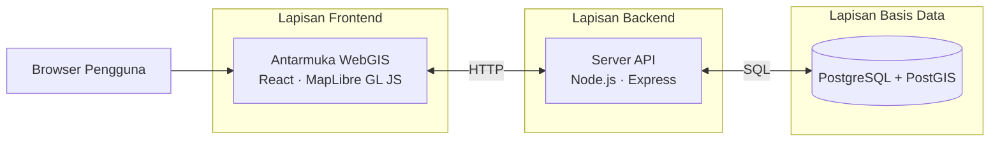
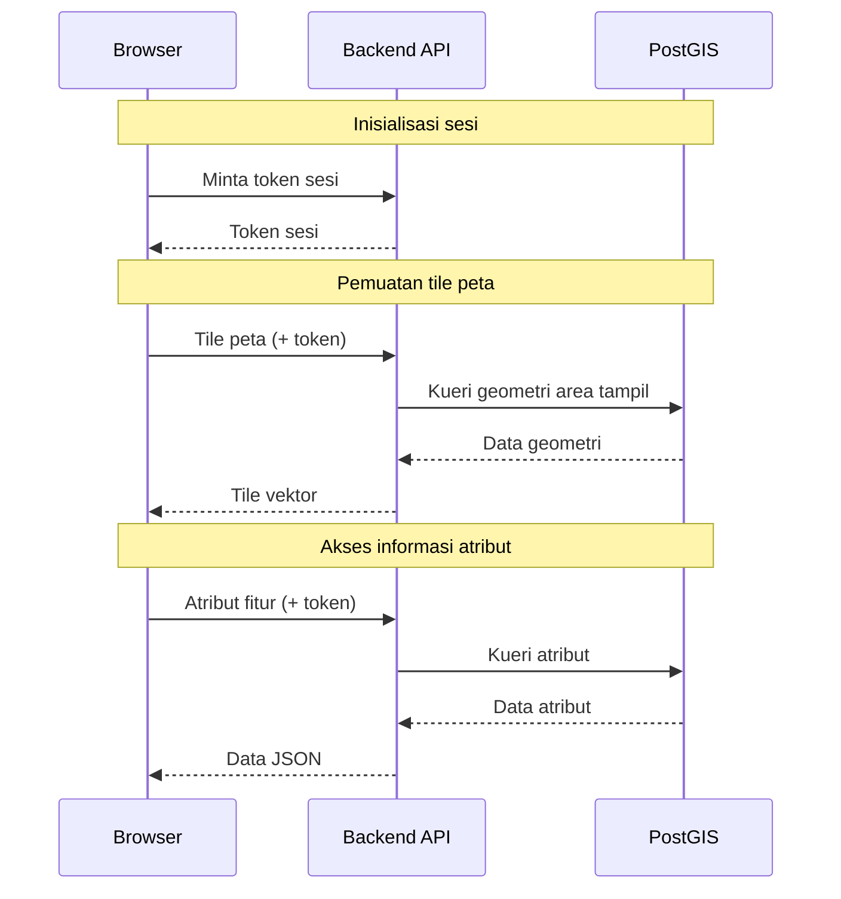
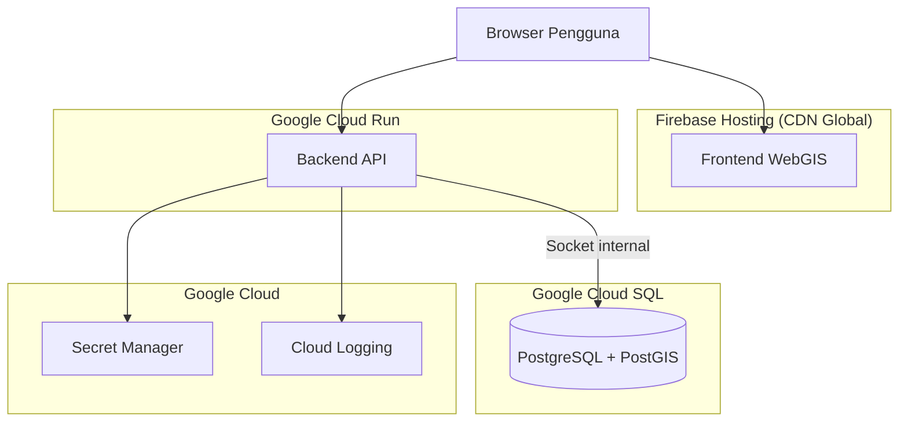

## **3.3.2** Pembangunan Sistem

Sistem WebGIS SEA-BANDL dibangun menggunakan arsitektur tiga lapis yang memisahkan tanggung jawab antara lapisan *frontend*, lapisan *backend* API, dan lapisan basis data spasial. Arsitektur berlapis ini mencerminkan pembagian kerja yang nyata dalam pengembangan sistem, di mana komponen basis data dan komponen WebGIS dikerjakan secara paralel oleh anggota tim yang berbeda. Kedua jalur pengembangan dapat berjalan dengan titik ketergantungan yang minimal: tim basis data dapat memperbarui skema tanpa harus menunggu persetujuan dari sisi *frontend*, selama bentuk data yang dikembalikan *endpoint* API tidak berubah.

Hal ini membawa konsekuensi yang perlu disadari. Pemisahan lapisan yang ketat menuntut adanya kesepakatan awal yang jelas tentang bentuk data yang dipertukarkan antara *backend* dan *frontend*. Perubahan yang tampak kecil di sisi basis data — misalnya penggantian nama kolom — dapat menyebabkan kegagalan diam-diam di sisi *frontend* apabila tidak dikomunikasikan. Dalam proyek ini, risiko tersebut dikelola melalui dokumentasi *endpoint* yang dijaga konsistensinya selama pengembangan berlangsung.

*Gambar 3.X. Arsitektur tiga lapis sistem WebGIS SEA-BANDL*

## **3.3.2.1** Halaman Peta / *Geo-dashboard*

Tantangan utama dalam merancang halaman peta terletak pada cara data geometri berskala nasional dapat disajikan secara interaktif di *browser* tanpa membebani jaringan maupun perangkat pengguna. Dataset batas laut NKRI mencakup ribuan segmen geometri yang membentang dari Sabang hingga Merauke — mengirimkan seluruhnya sekaligus tidak praktis untuk koneksi rata-rata pengguna, dan secara teknis berisiko menyebabkan kegagalan pemuatan pada perangkat dengan memori terbatas.

Solusi yang diadopsi adalah memotong data menjadi satuan *tile* — potongan geometri berbentuk persegi yang mencakup area tertentu pada tingkat perbesaran tertentu — dan mengirimkannya ke *browser* hanya untuk area yang sedang ditampilkan. *Tile* dikirimkan dalam format vektor biner yang diproses langsung oleh mesin rendering *browser* menggunakan WebGL, menghasilkan tampilan yang tajam pada berbagai resolusi layar. Format ini berbeda dengan pendekatan *tile* raster yang lebih tradisional: raster mengirimkan gambar yang sudah dirender di *server*, sementara format vektor menyerahkan proses *rendering* kepada *browser* menggunakan data geometri asli. Konsekuensinya, tampilan batas laut tetap tajam saat diperbesar tanpa bergantung pada resolusi gambar yang disiapkan sebelumnya.

Masalah kedua yang tidak kalah penting adalah bagaimana memastikan data tidak dapat diekstraksi secara massal di luar antarmuka yang disediakan. Data batas laut mengandung informasi yang relevan secara kedaulatan; distribusi tanpa kendali berpotensi menimbulkan masalah dari sisi kebijakan pengelolaan data. Sistem *login* berbasis akun pengguna adalah solusi yang paling umum dikenal, namun mekanisme tersebut membawa kompleksitas pengelolaan yang tidak proporsional untuk konteks ini. Mekanisme *display token* dipilih karena tidak memerlukan sistem *login* yang membutuhkan pengelolaan akun pengguna — pendaftaran, pemulihan kata sandi, manajemen sesi, dan sebagainya. Sebagai gantinya, *backend* menerbitkan kunci sesi sementara saat pertama kali halaman peta dimuat; kunci tersebut harus disertakan dalam setiap permintaan data selanjutnya. Token kedaluwarsa secara otomatis dan tidak dapat digunakan kembali setelah sesi berakhir. Mekanisme ini tidak mencegah pengguna teknis yang berpengalaman dari upaya pengambilan data secara manual, namun cukup untuk menghilangkan kemudahan bagi alat otomatis yang tidak memahami alur sesi.

Ketika pengguna mengklik suatu fitur pada peta, *frontend* mengirimkan permintaan ke *backend* yang kemudian mengambil data atribut lengkap dari basis data. Data yang dikembalikan mencakup identifikasi objek, status hukum, tipe batas, nama segmen, serta referensi ke dokumen sumber seperti undang-undang atau perjanjian bilateral yang menjadi dasar penetapan batas tersebut. Perlu dicatat bahwa data yang ditampilkan pada panel informasi ini bukan merupakan data presisi penuh dari basis data — geometri yang digunakan dalam *tile* telah mengalami penyederhanaan untuk keperluan visualisasi. Jika pengguna membutuhkan data koordinat lengkap, mekanisme pengajuan data formal disediakan terpisah melalui formulir institusional.

*Gambar 3.X. Tiga jalur komunikasi utama antara frontend dan backend pada halaman peta*

## **3.3.2.2** Filter Data

Filter data dirancang untuk membantu pengguna menelusuri informasi yang relevan dari keseluruhan dataset yang ditampilkan. Namun keputusan arsitekturalnya membawa trade-off yang perlu dipahami. Filter diimplementasikan sepenuhnya di sisi *frontend* — *browser* menyaring fitur yang tampil menggunakan data atribut yang sudah termuat dalam *tile*, tanpa mengirimkan permintaan baru ke *server* setiap kali kriteria filter diubah. Hasilnya adalah respons antarmuka yang terasa instan karena tidak ada latency jaringan yang terlibat.

Trade-off dari pendekatan ini adalah bahwa filter hanya dapat bekerja pada atribut yang memang ada di dalam *tile*. Atribut yang tidak disertakan saat *tile* dihasilkan — misalnya kolom yang hanya relevan untuk analisis mendalam — tidak dapat dijadikan kriteria filter. Ini merupakan pembatasan yang disadari: desain *tile* harus mempertimbangkan kebutuhan filter dari awal, bukan ditambahkan belakangan.

Sistem filter yang diimplementasikan mendukung kombinasi beberapa kriteria menggunakan operator logika AND dan OR dengan pengelompokan bertingkat, memungkinkan pengguna membangun ekspresi seleksi yang cukup kompleks. Konfigurasi filter yang disusun pengguna disimpan secara persisten di penyimpanan lokal *browser*, sehingga tetap aktif saat pengguna menavigasi antar halaman atau memuat ulang aplikasi — sebuah keputusan kecil yang berdampak signifikan pada kenyamanan penggunaan untuk pengguna yang secara rutin bekerja dengan subset data yang sama.

## **3.3.2.3** Geoprocessing Data

Fitur *geoprocessing* muncul dari kebutuhan yang tidak dapat dipenuhi hanya melalui tampilan visual: pengguna ingin mengetahui panjang segmen batas laut tertentu atau luas zona ekonomi eksklusif di wilayah tertentu. Pengukuran semacam ini memerlukan komputasi, dan pilihan di mana komputasi itu dilakukan — di *browser* atau di *server* — berdampak langsung pada akurasi hasilnya.

Komputasi dilakukan di sisi *server* menggunakan kemampuan geodetik PostGIS, bukan di *browser*. Alasannya menyangkut geometri bumi. Pengukuran panjang dan luas yang dilakukan menggunakan koordinat yang sudah diproyeksikan ke bidang datar — seperti yang tersedia di *browser* — menghasilkan nilai yang terdistorsi akibat deformasi proyeksi. Distorsi ini tidak konstan: semakin jauh dari titik pusat proyeksi, semakin besar kesalahan yang terakumulasi. Untuk fitur batas laut yang memanjang dalam arah lintang atau bujur yang jauh dari ekuator, perbedaannya dapat signifikan. PostGIS, sebaliknya, menyediakan tipe data *geography* yang melakukan komputasi langsung pada permukaan elipsoid WGS84, menghasilkan nilai yang secara geodetik lebih akurat dan konsisten dengan cara pengukuran yang digunakan dalam penetapan batas laut internasional.

Tiga operasi yang disediakan adalah pengukuran panjang kurva, pengukuran luas zona, dan pembentukan zona penyangga (*buffer*) dengan jarak yang ditentukan pengguna. Ketika permintaan masuk, *backend* memvalidasi parameter, mengeksekusi kueri spasial, menyederhanakan geometri hasil untuk keperluan tampilan, dan mengembalikannya sebagai layer sementara di atas peta. Validasi parameter diperlukan karena permintaan yang tidak dibatasi — misalnya *buffer* dengan jarak yang sangat besar atau operasi yang mencakup seluruh dataset — berpotensi membebani basis data secara tidak proporsional.

---

## **3.4** Penyebaran Sistem

### **3.4.1** Infrastruktur *Cloud*

Sistem disebarkan pada platform *cloud* yang menyediakan pengelolaan infrastruktur secara terkelola. Pilihan ini bukan tanpa pertimbangan. Ketergantungan pada platform *cloud* tertentu menciptakan *vendor lock-in* yang berarti migrasi di kemudian hari akan memerlukan upaya yang tidak kecil. Namun untuk konteks proyek TA dengan tenggat waktu dan kapasitas tim yang terbatas, kemampuan untuk tidak harus mengelola konfigurasi server secara manual adalah pertimbangan yang lebih menentukan.

Setiap komponen menempati layanan yang dipilih sesuai karakteristiknya. *Frontend* berupa kumpulan *file* statis yang paling efisien didistribusikan melalui jaringan distribusi konten (*Content Delivery Network*/CDN) — pengguna mengunduh *file* aplikasi dari server yang secara geografis terdekat dengan mereka, bukan dari satu server tunggal. *Backend* yang perlu merespons permintaan secara dinamis ditempatkan pada platform *serverless* yang mengelola kapasitas secara otomatis berdasarkan beban aktual. Basis data spasial berjalan pada layanan basis data terkelola yang menjamin persistensi dan integritas data tanpa memerlukan administrasi manual.

*Gambar 3.X. Infrastruktur penyebaran sistem WebGIS SEA-BANDL pada lingkungan produksi*

Nilai-nilai konfigurasi sensitif — kata sandi basis data, kunci token, dan parameter keamanan lainnya — tidak disimpan dalam kode sumber maupun dalam *image container*. Nilai-nilai tersebut diambil secara dinamis dari layanan manajemen rahasia saat *backend* dijalankan. Ini berarti bahwa akses ke repositori kode atau ke *image container* yang disebarkan tidak memberikan akses ke sistem produksi — sebuah prinsip yang penting terutama mengingat repositori proyek bersifat kolaboratif.

### **3.4.2** Penyebaran *Frontend*

Proses *build* menghasilkan sekumpulan *file* statis — HTML, JavaScript, CSS — yang kemudian disebarkan ke Firebase Hosting. Platform ini mendistribusikan *file* melalui CDN global dengan sertifikat HTTPS yang dikelola secara otomatis. Setelah *file* dimuat di *browser*, seluruh navigasi antar halaman ditangani oleh kode JavaScript tanpa memerlukan pemuatan ulang dari *server* — permintaan ke *server* hanya terjadi saat data diperlukan, bukan saat pengguna berpindah halaman. Sistem dapat diakses melalui `seabandl.app`.

### **3.4.3** Penyebaran *Backend*

Layanan *backend* dikemas dalam format *container* — paket mandiri yang membungkus kode aplikasi beserta seluruh ketergantungannya sehingga dapat berjalan secara konsisten di berbagai lingkungan. Keunggulan pendekatan ini terasa nyata saat *debugging*: masalah yang muncul di lingkungan produksi dapat direproduksi secara lokal menggunakan *container* yang identik, karena perbedaan konfigurasi sistem operasi tidak mempengaruhi perilaku aplikasi.

*Container* disebarkan ke Google Cloud Run, yang menjalankan instans baru secara otomatis saat trafik meningkat dan menghentikan instans yang tidak terpakai saat trafik mereda. Model ini mengandung implikasi yang tidak segera terlihat: instans yang baru dimulai memerlukan waktu beberapa detik untuk siap menerima permintaan — dikenal sebagai *cold start*. Untuk sistem seperti WebGIS yang tidak memiliki trafik kontinu, *cold start* dapat sesekali memperlambat respons pertama setelah periode tidak aktif. Hal ini merupakan konsekuensi dari model *serverless* yang perlu dipahami sebagai trade-off terhadap penghematan sumber daya.

Koneksi dari *backend* ke basis data dilakukan melalui *Unix socket* — mekanisme komunikasi antar proses dalam infrastruktur yang sama — yang disediakan oleh Cloud SQL Auth Proxy. Jalur ini tidak melewati jaringan publik, sehingga komunikasi antara *backend* dan basis data tidak dapat diintersepsi dari luar infrastruktur *cloud*.
