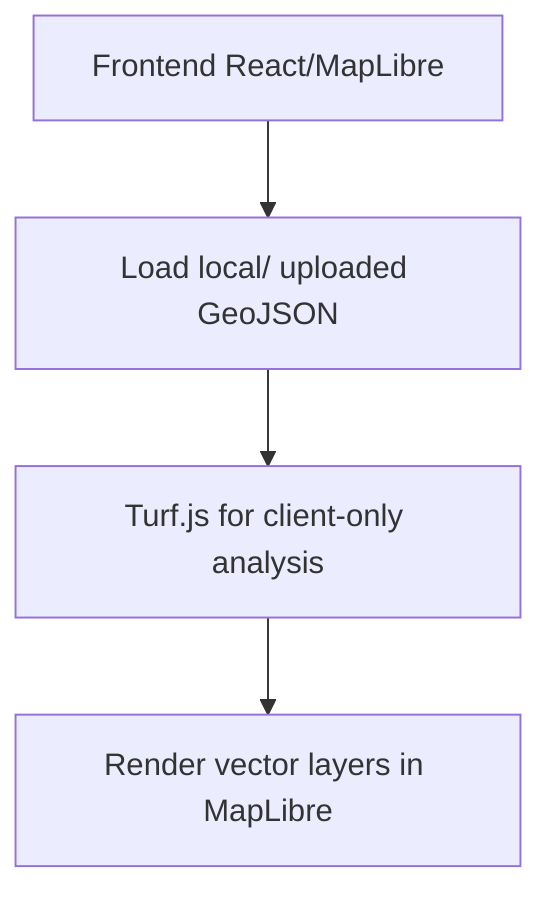
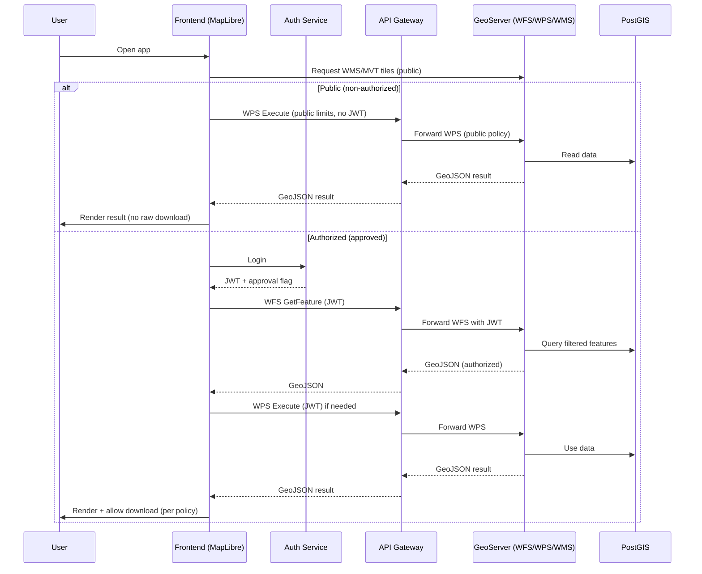
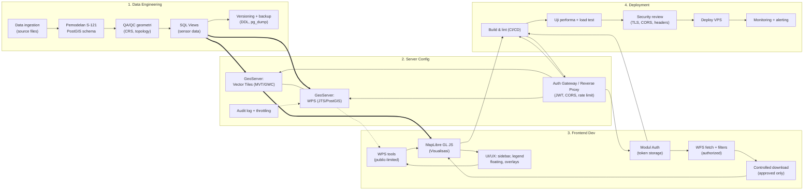

# WebGIS Architecture: Current vs Future (WPS/WFS/Auth)

> **Pembaruan 2026-05-26:** Kebijakan akses data terbaru (WebGIS tanpa login; data utuh via permintaan resmi; tutup celah API display) didokumentasikan di **[DATA_ACCESS_SECURITY_PLAN.md](./DATA_ACCESS_SECURITY_PLAN.md)**. Bagian “VPS”, “login + WFS untuk publik”, dan `useAuth` di bawah ini **bersifat historis** kecuali disebut lain.

This doc summarizes the full tech stack, the current state of the WebGIS, and the planned evolution to add WPS (JTS/GeoServer), WFS downloads for authorized users, and authentication/authorization. Mermaid diagrams included.

## Tech Stack

- **Frontend**: Vite, React 19, TypeScript, MapLibre GL JS v5, TailwindCSS, shadcn/ui, Zustand, Turf.js (client-side geoprocessing), React Router (portal + map routes).
- **Current Data**: 15 GeoJSON layer individual di-bundle di frontend (no external OGC services yet). UI menggunakan layout **Ribbon** + floating side panels dengan custom basemap thumbnail control.
- **Map Search**: Stadia Maps search box.
- **Theme/Basemap Runtime**: Light-only mode, default basemap `Esri Satellite`, basemap switch dikelola di runtime map modules.
- **Build/Deploy**: npm scripts; frontend hosted on Firebase Hosting (https://project1-seaboundaries.web.app).
- **Planned Backend**: GeoServer + PostGIS on VPS for OGC services (WMS/WFS/WPS).
- **Planned Auth**: Token-based (e.g., JWT via an auth gateway) to guard WFS/WPS and downloads.

## Current State (No WFS/WMS/WPS)



## Target State (With WFS + WPS + Auth)

```mermaid
flowchart TD
    subgraph Client
        PUBLIC[Public user (no login)]
        AUTHUSER[Authorized user (login + approved)]
        UI[MapLibre UI]
        WFSREQ[WFS fetch (GeoJSON, authorized)]
        WPSPUB[WPS Execute (public-limited)]
        WPSAUTH[WPS Execute (authorized)]
        RENDER[Render layers/results]
    end

    subgraph GatewayAuth
        AUTH[Auth Service (JWT/OAuth2)]
        PROXY[API Gateway / Reverse Proxy]
    end

    subgraph GeoServer
        WMS[WMS / MVT (public)]
        WFS[WFS (protected)]
        WPS[WPS (JTS/PostGIS)]
    end

    DB[(PostGIS)]

    PUBLIC --> UI
    AUTHUSER --> UI
    UI -->|Tiles (public)| WMS
    UI --> WPSPUB
    UI --> WFSREQ
    UI --> WPSAUTH
    WPSPUB --> PROXY
    WFSREQ --> PROXY
    WPSAUTH --> PROXY
    AUTHUSER --> AUTH --> PROXY
    PROXY --> WMS
    PROXY --> WFS
    PROXY --> WPS
    WMS --> DB
    WFS --> DB
    WPS --> DB
    WFS -->|GeoJSON (authorized)| RENDER
    WPS -->|GeoJSON (public/authorized)| RENDER
```

### Data Flow (Future)



## Roles & Authorization (future)

- **Public (non-authorized)**: Dapat membuka WebGIS, melihat peta, popup atribut publik, menjalankan geoprocessing (WPS) dengan batasan ukuran/waktu, tetapi **tidak bisa mengunduh data mentah**.
- **Authorized (approved)**: Setelah login + disetujui admin, dapat mengakses WFS/WMS terautentikasi dan mengunduh data mentah (mis. SHP/GeoJSON) sesuai kebijakan.
- **Download policy**: Unduhan hanya untuk authorized yang sudah di-approve; selalu melalui gateway + audit log; WFS dibatasi bbox/filter/paging dan rate limit. Public dibatasi ke data terpublikasi (MVT/WMS) tanpa raw download.

## WFS Plan

- Publish 15 layer batas maritim (`laut_teritorial_sepakat`, `laut_teritorial_perlu`, `zee_sepakat`, `zee_sepakat_ratif`, `zee_perlu`, `landas_kontinen_*`, `zona_tambahan`, `baseline`, `basepoints`, `titik_perjanjian_lt`, `titik_perjanjian_lk`, `titik_perjanjian_zee`) sebagai WFS di GeoServer, **hanya untuk authorized users**.
- Client path (authorized): `fetch` GeoJSON via `GetFeature` (bbox/cql_filter/paging) → load as MapLibre `geojson` source or provide download.
- Apply auth: Gateway validates JWT + approval flag; enforce per-role/per-layer access; log all downloads.

## WPS Plan (JTS / GeoServer)

- Enable WPS plugin in GeoServer. Expose a small set of processes (buffer, intersect, clip) backed by JTS/PostGIS.
- **Public** dapat menjalankan WPS untuk analisis ringan; hasil hanya ditampilkan (tidak mengakses tabel mentah). **Authorized** boleh mengunduh hasil jika diperlukan dan sesuai kebijakan.
- Client UI: form pilih layer/parameter → POST Execute → terima GeoJSON → render layer sementara; opsi unduh hanya muncul jika authorized.
- Controls: limit waktu/memori/ukuran fitur; sanitasi input; per-role throttling.

## Deployment

- **Frontend**: Firebase Hosting or VPS.
- **Backend**: VPS running GeoServer + PostGIS behind reverse proxy (Caddy/Nginx). Enable HTTPS, CORS, rate limiting.
- **Caching**: Optional CDN/cache for WMS tiles; consider gzip for WFS GeoJSON.

## Methodology & Development Flow (expanded)



## Checklist to move forward

- [ ] Provision VPS with PostGIS + GeoServer.
- [ ] Load maritime datasets into PostGIS; publish WMS/WFS; enable WPS plugin.
- [ ] Add auth service (JWT/OAuth2) and gateway enforcing it for WFS/WPS.
- [ ] Frontend: add WFS fetch path (toggle between local GeoJSON and WFS); add WPS Execute UI.
- [ ] Limit scope: bbox/paging for WFS; whitelisted WPS processes with size/time caps.
- [ ] Logging/monitoring for WFS/WPS usage; rate limits.
- [ ] E2E test flows: login → WFS fetch → WPS process → render/download.
