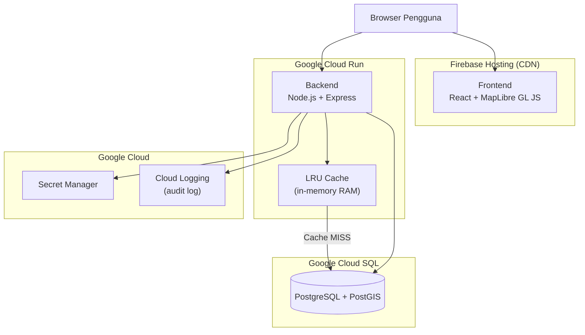
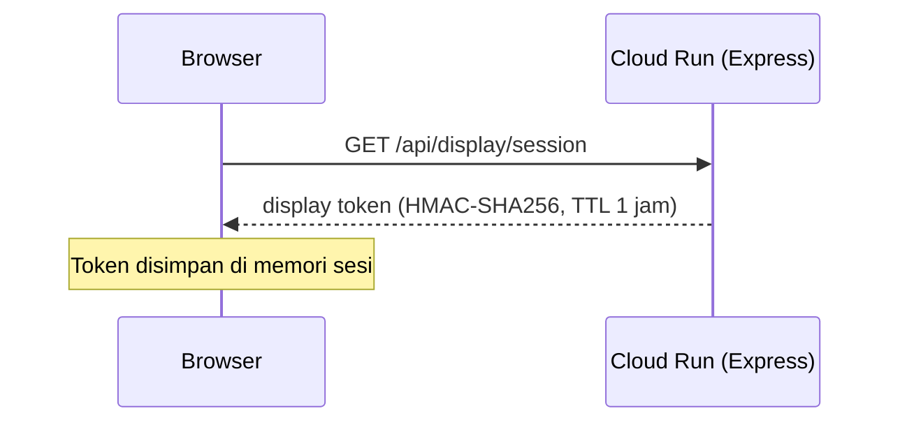
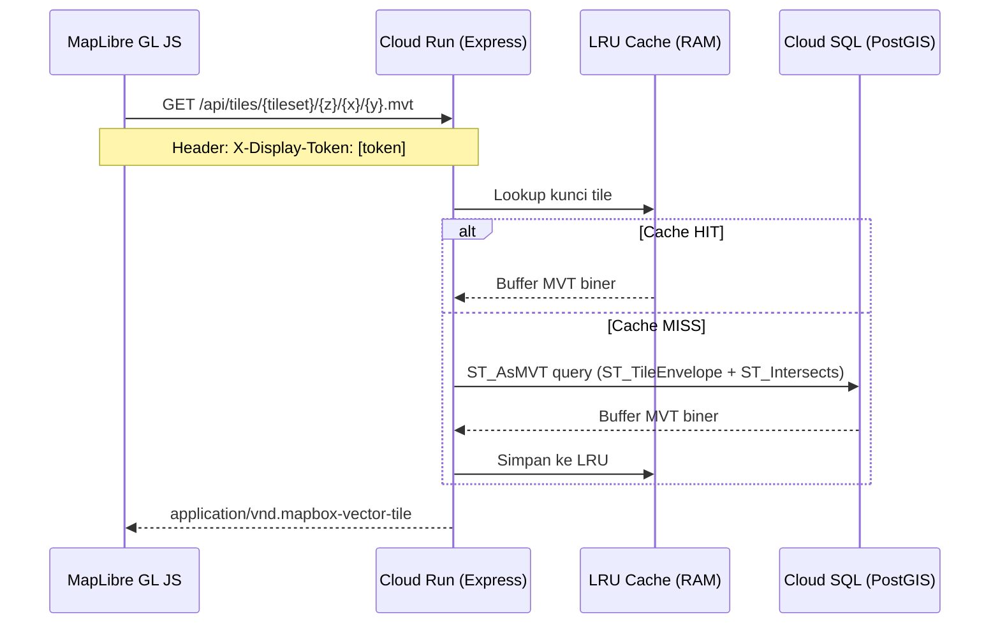
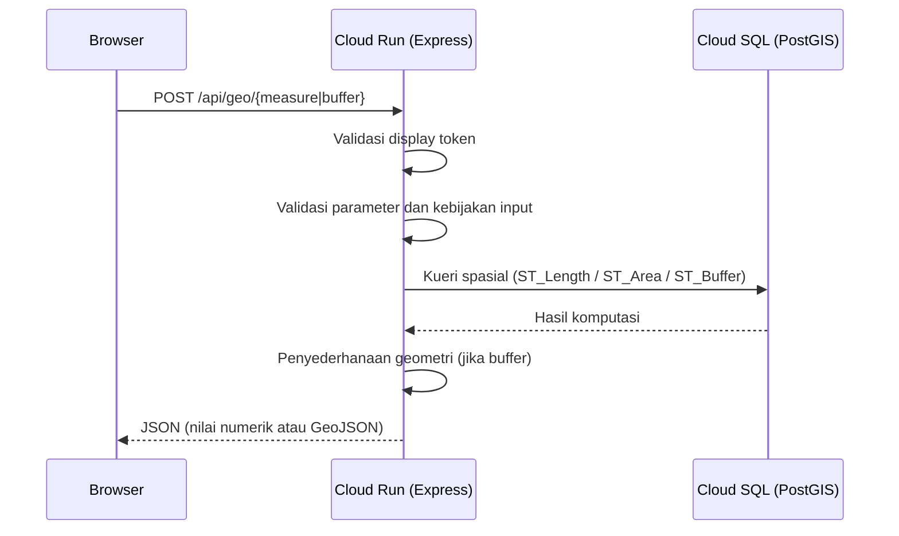
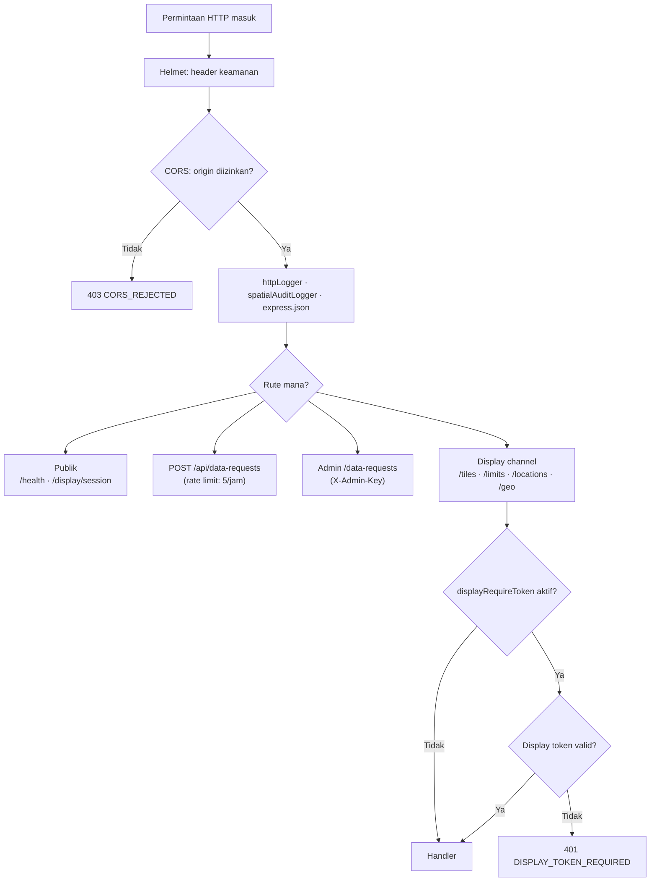

# WebGIS SEA-BANDL — Architecture Overview

> **Last updated: 2026-06-06**
> Dokumen ini menggambarkan arsitektur sistem yang **sedang berjalan** di produksi (`seabandl.app`).
> Dokumen arsitektur historis (rencana GeoServer/WFS/WPS/VPS yang tidak dilanjutkan) tersimpan di `docs/archive/`.

---

## Tech Stack

### Frontend
- **Framework**: React 19 + TypeScript, Vite 7
- **Peta**: MapLibre GL JS — rendering MVT tile dari backend
- **State**: Zustand
- **UI**: TailwindCSS + shadcn/ui
- **Routing**: React Router (portal multi-halaman + halaman peta)
- **Hosting**: Firebase Hosting → **[seabandl.app](https://seabandl.app)**

### Backend
- **Runtime**: Node.js + Express.js
- **Platform**: Google Cloud Run (`s121-backend`)
- **Database**: PostgreSQL + PostGIS (Google Cloud SQL), koneksi via Unix socket (Cloud Run) atau TCP (lokal)
- **Secrets**: Google Cloud Secret Manager
- **Logging**: Pino Logger → Google Cloud Logging

---

## Arsitektur Sistem

---

## Alur Data Utama

### 1. Inisialisasi Sesi Tampilan

### 2. Rendering Tile MVT

### 3. Geoprocessing

---

## Endpoint API

| Kategori | Endpoint | Akses |
|---|---|---|
| Sesi | `GET /api/display/session` | Publik |
| Health | `GET /health` | Publik |
| Tile MVT | `GET /api/tiles/:tileset/:z/:x/:y.mvt` | Display token |
| Atribut batas | `GET /api/limits` | Display token + bbox wajib |
| Atribut lokasi | `GET /api/locations` | Display token + bbox wajib |
| Metadata | `GET /api/sources`, `/api/curves`, dll. | Nonaktif di produksi |
| Geoprocessing | `POST /api/geo/measure`, `/api/geo/buffer` | Display token |
| Pengajuan data | `POST /api/data-requests` | Publik (rate-limited: 5/jam) |
| Admin | `GET/PATCH /api/data-requests` | X-Admin-Key header |

---

## Keamanan Berlapis

---

## Tileset MVT

Dua tileset gabungan tersedia via `/api/tiles/:tileset/:z/:x/:y.mvt`:

| Tileset | Isi |
|---|---|
| `boundaries` | Garis pangkal, laut teritorial, zona tambahan, ZEE, landas kontinen, landas kontinen ekstensi, fisheries |
| `points` | Titik garis pangkal (*basepoints*), titik perjanjian bilateral (TS, CS, ZEE) |

Layer individual juga didukung via `/api/tiles/:layerId/:z/:x/:y.mvt`.

---

## Kebijakan Data

- **Geometri**: Koordinat disederhanakan sebelum dikirimkan (default toleransi: 0,0005 derajat). Presisi penuh tidak pernah dikirimkan ke browser.
- **Atribut**: `bbox` wajib pada permintaan `/api/limits` dan `/api/locations`. Luas maksimum: 500 derajat persegi.
- **Metadata relasional**: Endpoint `/api/sources`, `/api/curves`, `/api/baunits` dinonaktifkan di produksi (`ENABLE_METADATA_API=false`).

---

## Deployment

| Komponen | Platform | URL |
|---|---|---|
| Frontend | Firebase Hosting | [seabandl.app](https://seabandl.app) |
| Backend | Google Cloud Run | Internal (tidak diekspos langsung) |
| Database | Google Cloud SQL | Via Unix socket (Cloud Run) |
| Secrets | Google Cloud Secret Manager | — |
| Logs | Google Cloud Logging | — |
