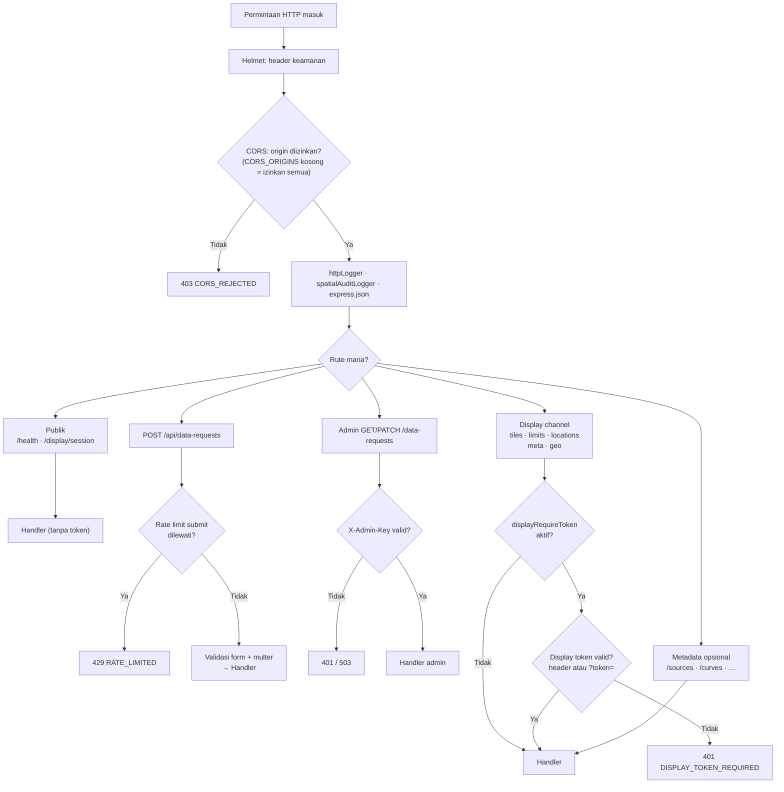

# Alur Keamanan Backend SEA-BANDL

Diagram berikut mencerminkan implementasi aktual di `backend/app.js`, `middleware/requireDisplayToken.js`, dan `lib/security.js`.

## Catatan implementasi

| Lapisan | Perilaku |
|---------|----------|
| **Helmet** | Middleware global pertama; CSP dinonaktifkan (API JSON saja) |
| **CORS** | Allowlist via `CORS_ORIGINS`; jika kosong, semua origin diizinkan (dev) |
| **Rate limit** | Hanya `POST /api/data-requests` (`buildRequestSubmitLimiter`); tidak ada limiter global di `app.js` |
| **Display token** | Hanya rute display channel; dilewati jika `DISPLAY_REQUIRE_TOKEN=false` |
| **Admin key** | `GET/PATCH /api/data-requests` memakai header `X-Admin-Key` |
| **Metadata opsional** | `/baselines`, `/curves`, `/sources`, dll. — tanpa display token jika `ENABLE_METADATA_API=true` |

## Referensi kode

- `backend/app.js` — urutan middleware dan mount router
- `backend/middleware/requireDisplayToken.js` — verifikasi display token
- `backend/lib/security.js` — Helmet, CORS, rate limiter factories
- `backend/lib/adminAuth.js` — autentikasi admin data-requests
- `backend/lib/displayConfig.js` — kebijakan `displayRequireToken()`, `useMvtDisplay()`
