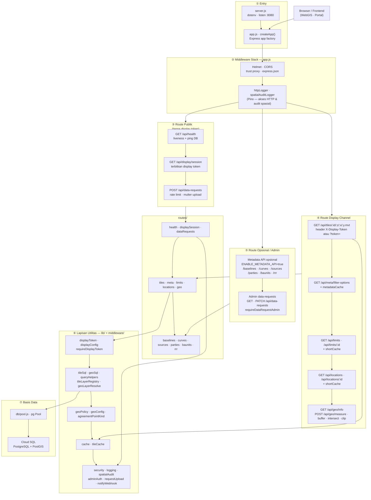

# Struktur Backend SEA-BANDL

Stack: **Node.js · Express 4 · PostgreSQL + PostGIS (`pg`) · Pino · Helmet · CORS · Multer**.

Diagram global di bawah merangkum arsitektur backend (`backend/`) dalam satu peta vertikal.

## Keterangan singkat

| Blok | Isi utama |
|------|-----------|
| **① Entry** | `server.js` bootstrap; `createApp()` membangun Express tanpa side-effect listen |
| **② Middleware** | Keamanan HTTP, CORS, JSON body, logging, audit akses spasial |
| **③ Publik** | Health, penerbitan token sesi, submit permintaan data |
| **④ Display channel** | Tile MVT, atribut layer, filter meta, geoprocessing — butuh display token* |
| **⑤ Opsional / admin** | Metadata S-121 penuh (flag env) dan operasi admin permintaan data |
| **⑥ Utilitas** | Token, SQL spasial, kebijakan geo, cache, keamanan |
| **⑦ DB** | Koneksi pool ke Cloud SQL (proxy lokal atau unix socket di Cloud Run) |

\* **`requireDisplayToken`** aktif secara default saat `DISPLAY_MODE=mvt`. Token dikirim via header `X-Display-Token` atau query `?token=`. Jika `DISPLAY_REQUIRE_TOKEN=false`, middleware dilewati.

## Pemetaan file

| Area | Lokasi |
|------|--------|
| Bootstrap | `server.js`, `app.js` |
| Middleware token | `middleware/requireDisplayToken.js` |
| Route handlers | `routes/*.js` |
| Kebijakan display | `lib/displayConfig.js`, `lib/displayToken.js` |
| SQL spasial | `lib/tileSql.js`, `lib/geoSql.js`, `lib/queryHelpers.js` |
| Cache | `lib/cache.js` (HTTP), `lib/tileCache.js` (MVT in-memory) |
| Koneksi DB | `db/pool.js` |
| Migrasi | `migrations/*.sql` |
| Tes | `test/*.test.js` |

## Endpoint per kategori

**Publik (tanpa display token):**
- `GET /api/health`
- `GET /api/display/session`
- `POST /api/data-requests` (rate limit khusus)

**Display channel (display token):**
- `GET /api/tiles/:tilesetOrLayer/:z/:x/:y.mvt`
- `GET /api/meta/filter-options`
- `GET /api/limits`, `GET /api/limits/:fuid`
- `GET /api/locations`, `GET /api/locations/:fuid`
- `GET /api/geo/info`, `POST /api/geo/measure|buffer|intersect|clip`

**Admin (API key operator):**
- `GET /api/data-requests`, `GET /api/data-requests/:id`, `PATCH /api/data-requests/:id`

**Metadata API (hanya jika `ENABLE_METADATA_API=true`, tanpa display token):**
- `GET /api/baselines`, `/api/curves`, `/api/sources`, `/api/parties`, `/api/baunits`, `/api/rrr`
