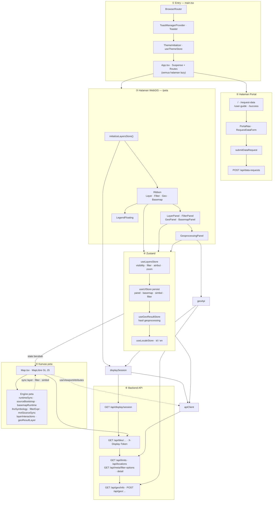

# Struktur Frontend SEA-BANDL

Stack: **Vite · React 19 · TypeScript · MapLibre GL JS · Zustand · React Router · TailwindCSS · shadcn/ui**.

Diagram global di bawah merangkum seluruh arsitektur frontend dalam satu peta.

## Keterangan singkat

| Blok | Isi utama |
|------|-----------|
| **① Shell** | Bootstrap React, router, toast, tema |
| **② Portal** | Route informasi & permintaan data → `POST /api/data-requests` |
| **③ WebGIS** | Bootstrap layer, ribbon, panel, legend |
| **④ Stores** | State layer, UI peta, hasil geo, locale |
| **⑤ Kanvas** | MapLibre + engine sinkronisasi peta |
| **⑥ Backend** | Sesi, tile MVT, atribut, geoprocessing |

**Catatan:** `UserLayerPanel` (impor GeoJSON pengguna) ada di codebase tetapi belum di-mount di UI.
