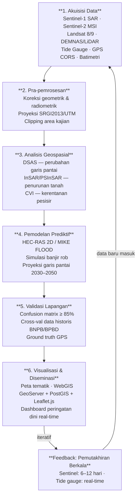

# Alur Metodologi Analisis Geolingkungan Pesisir

```mermaid
flowchart TD
    A["**1. Akuisisi Data**
    Sentinel-1 SAR · Sentinel-2 MSI
    Landsat 8/9 · DEMNAS/LiDAR
    Tide Gauge · GPS CORS · Batimetri"]

    B["**2. Pra-pemrosesan**
    Koreksi geometrik & radiometrik
    Proyeksi SRGI2013/UTM
    Clipping area kajian"]

    C["**3. Analisis Geospasial**
    DSAS — perubahan garis pantai
    InSAR/PSInSAR — penurunan tanah
    CVI — kerentanan pesisir"]

    D["**4. Pemodelan Prediktif**
    HEC-RAS 2D / MIKE FLOOD
    Simulasi banjir rob
    Proyeksi garis pantai 2030–2050"]

    E["**5. Validasi Lapangan**
    Confusion matrix ≥ 85%
    Cross-val data historis BNPB/BPBD
    Ground truth GPS"]

    F["**6. Visualisasi & Diseminasi**
    Peta tematik · WebGIS
    GeoServer + PostGIS + Leaflet.js
    Dashboard peringatan dini real-time"]

    G["**Feedback: Pemutakhiran Berkala**
    Sentinel: 6–12 hari · Tide gauge: real-time"]

    A --> B --> C --> D --> E --> F
    F -->|iteratif| G
    G -->|data baru masuk| A
```