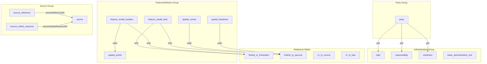

# IHO S-121 Maritime Limits & Boundaries — Database Schema Documentation

> **Standard**: IHO S-121 (Maritime Limits and Boundaries)  
> **Database**: PostgreSQL 15 + PostGIS  
> **SRID**: 4326 (WGS84)  
> **Host**: Google Cloud SQL  
> **Last Updated**: 2026-06 *(post source normalization; Zone + Governance seeds)*
> **Data-Quality Status**: ✅ Clean — zero orphans, referentially intact (see `docs/Laporan_TA/LAPORAN_AUDIT_BASIS_DATA.md`)

---

## 1. Ringkasan Arsitektur

Skema database ini mengimplementasikan standar IHO S-121 yang mengatur tentang batas-batas maritim (*Maritime Limits and Boundaries*). Standar S-121 sendiri diturunkan dari model LADM (*Land Administration Domain Model*) yang diadaptasi ke domain kelautan.

Berdasarkan UML *Application Schema Model* (Figure B-1), arsitektur dibagi ke dalam **4 blok utama** dengan total **27 tabel fisik S-121** (15 entitas + 12 junction) di schema `public`. Blok Source Group memakai **tiga tabel** (`source_reference`, `source_online_resource`, `source`) menggantikan satu tabel `source` ter-flatten. Satu **view** `source_flat` menyediakan proyeksi JOIN untuk API. Entitas **Zone** (`feature_model_zone`) dan **Governance** (`governance`) ditambahkan Juni 2026 beserta tiga tabel relasi (`fmzone_to_bau`, `fmzone_to_fmlimit`, `governance_to_bau`). Jika ditambah PostGIS (`spatial_ref_sys`), total tabel di `public` adalah **28**:



---

## 2. Party Group

Blok ini merepresentasikan pihak-pihak (*stakeholder*) yang terlibat dalam penetapan batas maritim, seperti negara pantai (*coastal state*) dan negara tetangga (*adjacent state*).

### 2.1. Tabel `party`

| UML Class | `S121 Party::Party` |
|---|---|
| UML Reference | Figure B-1 (Party Group) |

| Kolom | Tipe | Constraint | Deskripsi |
|---|---|---|---|
| `pID` | `VARCHAR(50)` | **PK**, NOT NULL | Kode ISO negara (e.g. `IDN`, `AUS`) |
| `partyName` | `VARCHAR(255)` | NOT NULL | Nama negara |
| `partyRole` | `VARCHAR(255)` | NOT NULL | Peran: `rightsHolder` atau `adjacentState` |
| `partyType` | `VARCHAR(255)` | NOT NULL | Tipe: `stateCountry` |

**Contoh Data:**

| pID | partyName | partyRole | partyType |
|---|---|---|---|
| `IDN` | Indonesia | rightsHolder | stateCountry |
| `AUS` | Australia | adjacentState | stateCountry |
| `MYS` | Malaysia | adjacentState | stateCountry |

> [!NOTE]
> Indonesia (`IDN`) adalah satu-satunya entitas dengan peran `rightsHolder`. Seluruh 10 negara lainnya berperan sebagai `adjacentState`.

---

## 3. Administrative Group — RRR (Right, Restriction, Responsibility)

Blok ini mengimplementasikan konsep **RRR** (*Right, Restriction, Responsibility*) dari LADM. Dalam UML, ketiga class ini merupakan turunan dari class abstrak `S121 Administrative::Right Restriction Responsibility`.

Karena class induknya bersifat **abstrak**, maka tidak dibuatkan tabel fisik. Sebagai gantinya, atribut-atribut induk diturunkan ke masing-masing tabel anak. Pola ini disebut **Concrete Table Inheritance**.

### 3.1. Tabel `"right"`

| UML Class | `S121 Administrative::Right` |
|---|---|
| UML Reference | Figure B-1 (Administrative Group) |

> [!WARNING]
> Kata `right` adalah **reserved keyword** di PostgreSQL. Nama tabel ini harus selalu diapit tanda kutip ganda (`"right"`) dalam setiap query.

| Kolom | Tipe | Constraint | Deskripsi |
|---|---|---|---|
| `rrrID` | `VARCHAR(50)` | **PK** | ID unik Right (e.g. `RIGHT-001`) |
| `rightType` | `VARCHAR(255)` | NOT NULL | Jenis hak: `sovereignty`, `sovereignRight`, `contiguousRight` |
| `rightRestrictionResponsibilityDescription` | `TEXT` | — | Deskripsi lengkap hak |
| `rightRestrictionResponsibilityShare` | `NUMERIC` | — | Bagian hak (selalu `1` = 100%) |
| `rightRestrictionResponsibilityShareCheck` | `BOOLEAN` | — | Validasi share |
| `pID` | `VARCHAR(50)` | — | FK ke `party.pID` |

**Total Data:** 3 tupel

### 3.2. Tabel `responsibility`

| UML Class | `S121 Administrative::Responsibility` |
|---|---|
| UML Reference | Figure B-1 (Administrative Group) |

| Kolom | Tipe | Constraint | Deskripsi |
|---|---|---|---|
| `rrrID` | `VARCHAR(50)` | **PK** | ID unik Responsibility (e.g. `RESPONSIBILITY-001`) |
| `responsibilityType` | `VARCHAR(255)` | NOT NULL | Jenis tanggung jawab |
| `rightRestrictionResponsibilityDescription` | `TEXT` | — | Deskripsi lengkap |
| `rightRestrictionResponsibilityShare` | `NUMERIC` | — | Bagian tanggung jawab |
| `rightRestrictionResponsibilityShareCheck` | `BOOLEAN` | — | Validasi share |
| `pID` | `VARCHAR(50)` | — | FK ke `party.pID` |

**Total Data:** 6 tupel

### 3.3. Tabel `restriction`

| UML Class | `S121 Administrative::Restriction` |
|---|---|
| UML Reference | Figure B-1 (Administrative Group) |

| Kolom | Tipe | Constraint | Deskripsi |
|---|---|---|---|
| `rrrID` | `VARCHAR(50)` | **PK** | ID unik Restriction (e.g. `RESTRICTION-001`) |
| `restrictionType` | `VARCHAR(255)` | NOT NULL | Jenis pembatasan |
| `partyRequired` | `BOOLEAN` | — | Apakah memerlukan pihak terkait |
| `rightRestrictionResponsibilityDescription` | `TEXT` | — | Deskripsi lengkap |
| `rightRestrictionResponsibilityShare` | `NUMERIC` | — | Bagian pembatasan |
| `rightRestrictionResponsibilityShareCheck` | `BOOLEAN` | — | Validasi share |
| `pID` | `VARCHAR(50)` | — | FK ke `party.pID` |

**Total Data:** 8 tupel

> [!IMPORTANT]
> Kolom `rrrID` di ketiga tabel RRR harus **unik secara global** (tidak boleh ada rrrID yang sama di tabel `"right"`, `responsibility`, dan `restriction`), karena tabel relasi `rrr_to_source` dan `rrr_to_bau` merujuk ke `rrrID` dari ketiga tabel ini secara bersamaan.

### 3.4. Tabel `basic_administrative_unit`

| UML Class | `S121 Administrative::BasicAdministrativeUnit` |
|---|---|
| UML Reference | Figure B-1 (Administrative Group) |

| Kolom | Tipe | Constraint | Deskripsi |
|---|---|---|---|
| `uID` | `VARCHAR(50)` | **PK** | ID unik BAUnit (e.g. `BA_01`) |
| `basicAdministrativeUnitName` | `VARCHAR(255)` | NOT NULL | Nama zona (e.g. `Teritorial Sea`) |
| `basicAdministrativeUnitType` | `VARCHAR(100)` | NOT NULL | Tipe zona (e.g. `MaritimeLimitsAndBoundaries`) |
| `basicAdministrativeUnitContext` | `TEXT` | — | Konteks/deskripsi zona maritim |
| `pID` | `VARCHAR(50)` | — | FK ke `party.pID` |

**Total Data:** 9 tupel *(termasuk `BA_09` Fisheries Zone)*

### 3.5. Tabel `governance`

| UML Class | `S121 Administrative::Governance` |
|---|---|
| UML Reference | Figure B-1 (Administrative Group) |

| Kolom | Tipe | Constraint | Deskripsi |
|---|---|---|---|
| `govID` | `VARCHAR(50)` | **PK** | ID unik governance (e.g. `GOV001`) |
| `reference_number` | `VARCHAR(100)` | NOT NULL | Nomor referensi (e.g. `UNCLOS 1982`) |
| `label` | `VARCHAR(255)` | NOT NULL | Label singkat |
| `name` | `VARCHAR(255)` | NOT NULL | Nama ringkas (Indonesia) |
| `governance_title` | `TEXT` | NOT NULL | Judul resmi instrumen hukum |
| `governance_description` | `TEXT` | — | Deskripsi cakupan |
| `releasibility_type` | `VARCHAR(50)` | NOT NULL | Tingkat rilis (e.g. `Public`) |
| `date_approved` | `DATE` | — | Tanggal pengesahan |
| `date_introduced` | `DATE` | — | Tanggal berlaku |
| `sID` | `VARCHAR(50)` | NOT NULL | FK ke `source.sID` (dokumen sumber utama) |

**Total Data:** **7 tupel** *(seed `seed_governance.sql`)*  
**CSV sumber:** `Governance - Governance.csv`  
**Prefix `govID`:** `GOV001` … `GOV007` (UNCLOS, UU 17/1985, UU 6/1996, UU 43/2008, UU 16/2023, PP 37/2002, Keppres perikanan IDN–AUS)

---

## 4. Feature/Attribute Group

Blok ini adalah **inti utama** dari skema S-121, berisi data fitur (*Feature Unit*) dan atribut spasial (*Spatial Attribute*) yang merepresentasikan batas-batas maritim Indonesia.

### 4.1. Feature Unit — Limit (Garis Batas)

#### Tabel `feature_model_limit`

| UML Class | `S121 Feature::FeatureUnit` (tipe: Limit/Curve) |
|---|---|
| UML Reference | Figure B-3 (Feature Unit) |

| Kolom | Tipe | Constraint | Deskripsi |
|---|---|---|---|
| `fuID` | `VARCHAR(50)` | **PK** | ID fitur unik (e.g. `LIM_BSL_001`, `LIM_EEZ_01`) |
| `label` | `VARCHAR(255)` | NOT NULL | Deskripsi limit |
| `status` | `VARCHAR(50)` | NOT NULL | Status: `Unilateral`, `Agreement`, `Need Agreement`, dll. |
| `releasibility_type` | `VARCHAR(50)` | NOT NULL | Tingkat rilis: `Official`, `Internal` |
| `limit_object_type` | `VARCHAR(100)` | NOT NULL | Jenis objek limit (e.g. `Archipelagic Baseline`, `International Boundary`) |
| `arc_geometry_type` | `VARCHAR(50)` | NOT NULL | Tipe geometri: `geodesic` |
| `start_life_span` | `DATE` | NOT NULL | Tanggal mulai berlaku |
| `end_life_span` | `DATE` | — | Tanggal berakhir (NULL = masih berlaku) |
| `horizontal_datum` | `VARCHAR(50)` | NOT NULL | Datum horizontal: `WGS84` |

**Total Data:** **237 tupel** *(verified 2026-05-24)*  
**Prefix fuID:** `LIM_BSL_*` (Baseline), `LIM_TS_*` (Territorial Sea), `LIM_CZ_*` (Contiguous Zone), `LIM_EEZ_*` (Exclusive Economic Zone), `LIM_CS_*` (Continental Shelf), `LIM_FISH_*` (Fisheries Zone), `LIM_MOF_*` (Mouth of File)

### 4.2. Feature Unit — Zone (Zona Maritim)

#### Tabel `feature_model_zone`

| UML Class | `S121 Feature::FeatureUnit` (tipe: Zone) |
|---|---|
| UML Reference | Figure B-3 (Feature Unit) |

| Kolom | Tipe | Constraint | Deskripsi |
|---|---|---|---|
| `fuID` | `VARCHAR(50)` | **PK** | ID zona (e.g. `ZONE_TS`, `ZONE_EEZ`) |
| `label` | `VARCHAR(255)` | NOT NULL | Nama zona |
| `releasibility_type` | `VARCHAR(50)` | NOT NULL | Tingkat rilis: `Internal`, dll. |
| `zone_object_type` | `VARCHAR(100)` | NOT NULL | Jenis zona S-121 (e.g. `Territorial Sea`, `Fisheries Zone`) |
| `jurisdiction_domain_type_list` | `VARCHAR(100)` | NOT NULL | Domain yurisdiksi (e.g. `Water Surface`) |
| `surface_relation` | `VARCHAR(50)` | NOT NULL | Relasi permukaan (e.g. `On Surface`) |
| `horizontal_datum` | `VARCHAR(50)` | NOT NULL | Datum horizontal: `WGS84` |
| `start_life_span` | `DATE` | NOT NULL | Tanggal mulai berlaku |
| `end_life_span` | `DATE` | — | Tanggal berakhir (NULL = masih berlaku) |

**Total Data:** **6 tupel** *(seed `seed_zone.sql`)*  
**Prefix fuID:** `ZONE_TS`, `ZONE_CZ`, `ZONE_EEZ`, `ZONE_CS`, `ZONE_FISH`, `ZONE_ECS`

> [!NOTE]
> Zone tidak menyimpan geometri langsung. Batas spasial zona direpresentasikan melalui relasi ke **Limit** (`fmzone_to_fmlimit`) dan ke **BAUnit** administratif (`fmzone_to_bau`). CSV: `Feature Model_ ZONE - Zone.csv`.

### 4.3. Feature Unit — Location (Titik Referensi)

#### Tabel `feature_model_location`

| UML Class | `S121 Feature::FeatureUnit` (tipe: Location/Point) |
|---|---|
| UML Reference | Figure B-3 (Feature Unit) + Figure B-4 (Spatial Attribute Type) |

| Kolom | Tipe | Constraint | Deskripsi |
|---|---|---|---|
| `fuID` | `VARCHAR(50)` | **PK** | ID fitur unik (e.g. `LOC_TD.001_2002`) |
| `label` | `VARCHAR(255)` | NOT NULL | Deskripsi lokasi |
| `status` | `VARCHAR(50)` | NOT NULL | Status titik |
| `releasibility_type` | `VARCHAR(50)` | NOT NULL | Tingkat rilis |
| `location_type_list` | `VARCHAR(100)` | NOT NULL | Jenis titik: `Baseline Point`, `Boundary Point` |
| `interpolation_role` | `VARCHAR(50)` | NOT NULL | Peran interpolasi: `deflection` |
| `point_type` | `VARCHAR(50)` | NOT NULL | Tipe titik: `defined` |
| `start_life_span` | `DATE` | NOT NULL | Tanggal mulai berlaku |
| `end_life_span` | `DATE` | — | Tanggal berakhir |
| `horizontal_datum` | `VARCHAR(50)` | NOT NULL | Datum horizontal |
| `vertical_datum` | `VARCHAR(50)` | — | Datum vertikal (nullable) |

**Total Data:** **21.293 tupel** *(verified 2026-05-24)*

> [!IMPORTANT]
> **Prefix `fuID` di `feature_model_location` TIDAK seragam.** Sebagian besar baris menggunakan prefix `LOC_*` (e.g. `LOC_TD.001_2002`), namun **308 baris menggunakan prefix `P_B_*`** untuk merepresentasikan *boundary points* perjanjian internasional. Distribusinya:
>
> | Prefix | Jumlah | Konteks |
> |---|---:|---|
> | `LOC_*` | 20.985 | Titik baseline & turning point nasional |
> | `P_B_CS_*`, `P_B_CS_A*` | 135 | Continental Shelf points (PNG 1971/1980, AUS) |
> | `P_B_EEZ_*`, `P_B_EEZ_Z*` | 108 | EEZ boundary points |
> | `P_B_MOF_*` | 43 | Mouth of File points |
> | `P_B_TS_*` | 19 | Territorial Sea boundary points |
> | `P_B_CS/EEZ_C*` | 3 | Joint CS/EEZ boundary points |
>
> Frontend / API filters sebaiknya **tidak** mengasumsikan `fuid LIKE 'LOC_%'` — gunakan filter berbasis kolom `location_type_list` atau biarkan apa adanya.

### 4.4. Spatial Attribute — Points

#### Tabel `spatial_points`

| UML Class | `S121 Feature::S121_SpatialAttributeType` (geometri: Point) |
|---|---|
| UML Reference | Figure B-4 (Spatial Attribute Type) |

| Kolom | Tipe | Constraint | Deskripsi |
|---|---|---|---|
| `saID` | `VARCHAR(50)` | **PK** | ID atribut spasial (e.g. `TD.001_2002`) |
| `location` | `VARCHAR(255)` | — | Nama lokasi geografis |
| `latitude` | `VARCHAR(50)` | — | Lintang dalam format DMS |
| `longitude` | `VARCHAR(50)` | — | Bujur dalam format DMS |
| `geom` | `GEOMETRY(Geometry, 4326)` | — | Geometri PostGIS (`MULTIPOINT`) |

**Total Data:** **16.533 tupel** *(verified 2026-05-24)*

### 4.5. Spatial Attribute — Curves

#### Tabel `spatial_curves`

| UML Class | `S121 Feature::S121_SpatialAttributeType` (geometri: Curve) |
|---|---|
| UML Reference | Figure B-4 (Spatial Attribute Type) |

| Kolom | Tipe | Constraint | Deskripsi |
|---|---|---|---|
| `saID` | `VARCHAR(50)` | **PK** | ID atribut spasial (e.g. `CURVE_CS_06`) |
| `location` | `VARCHAR(255)` | — | Nama perairan/lokasi |
| `geom` | `GEOMETRY(Geometry, 4326)` | — | Geometri PostGIS (`LINESTRING`) |

**Total Data:** ~89 tupel

### 4.6. Spatial Attribute — Baselines

#### Tabel `spatial_baselines`

| UML Class | `S121 Feature::S121_SpatialAttributeType` (geometri: Curve, subtipe Baseline) |
|---|---|
| UML Reference | Figure B-4 (Spatial Attribute Type) |

| Kolom | Tipe | Constraint | Deskripsi |
|---|---|---|---|
| `saID` | `VARCHAR(50)` | **PK** | ID atribut spasial (e.g. `BSL_001`) |
| `location` | `VARCHAR(255)` | — | Nama perairan/lokasi |
| `bsl_type` | `VARCHAR(255)` | — | Tipe baseline: `Straight Archipelagic Baseline`, `Common Baseline`, dll. |
| `geom` | `GEOMETRY(Geometry, 4326)` | — | Geometri PostGIS (`LINESTRING`) |

**Total Data:** 193 tupel

> [!NOTE]
> `spatial_curves` dan `spatial_baselines` keduanya merupakan implementasi dari class `S121_SpatialAttributeType` dengan geometri bertipe Curve (LINESTRING). Pemisahan ke dua tabel dilakukan karena baseline memiliki atribut tambahan (`bsl_type`) yang tidak dimiliki oleh curve biasa.

---

## 5. Source Group

Blok ini berisi data sumber referensi hukum, administrasi, dan geospasial (*Source*) yang mendasari batas maritim. Implementasi mengikuti UML Figure B-6: entitas inti `Source`, datatype `onlineResource`, dan `responsibleParty` (+ contact/address digabung per baris REF).

> [!NOTE]
> Skema **legacy** (satu tabel `source` ~32 kolom, `seed_source.sql`) digantikan pada **Juni 2026** oleh model normalisasi di bawah. Migrasi: `patches/migrate_source_normalize.sql`. Rencana: `docs/SOURCE_NORMALIZATION_PLAN.md`.

### 5.1. Tabel `source_reference`

| UML | `S121 Source::responsibleParty` (+ contact/address per baris) |
|---|---|

| Kolom | Tipe | Constraint | Deskripsi |
|---|---|---|---|
| `sourceReferenceID` | `VARCHAR(50)` | **PK** | ID pihak bertanggung jawab (e.g. `REF_001` … `REF_004`) |
| `responsiblePartyOganizationName` | `TEXT` | — | Nama organisasi |
| `responsiblePartyPositionName` | `TEXT` | — | Jabatan |
| `responsiblePartyRole` | `VARCHAR(50)` | — | Peran (Publisher, Custodian, Distributor) |
| `responsiblePartyContactOnline` | `TEXT` | — | URL kontak |
| `responsiblePartyContactPhone` | `VARCHAR(50)` | — | Telepon |
| `responsiblePartyContactAddressCountry` | `VARCHAR(100)` | — | Negara |
| `responsiblePartyContactAddressDeliveryPoint` | `TEXT` | — | Alamat |
| `responsiblePartyContactAddressCity` | `VARCHAR(100)` | — | Kota |
| `responsiblePartyContactElectronicMailAddress` | `VARCHAR(255)` | — | Email |
| `responsiblePartyContactAddressAdministrativeArea` | `VARCHAR(100)` | — | Provinsi/wilayah |
| `responsiblePartyContactAddressPostalCode` | `VARCHAR(50)` | — | Kode pos |

**Total Data:** **4 tupel** (dibagi 51 dokumen `source`)

| sourceReferenceID | Organisasi | Jumlah `source` |
|---|---|---:|
| `REF_001` | United Nations (Publisher) | 1 |
| `REF_002` | Government of the Republic of Indonesia | 29 |
| `REF_003` | United Nations (Custodian) | 14 |
| `REF_004` | Asian Maritime Index | 7 |

### 5.2. Tabel `source_online_resource`

| UML | `S121 Source::onlineResource` |
|---|---|

| Kolom | Tipe | Constraint | Deskripsi |
|---|---|---|---|
| `sourceOnlineResourceID` | `VARCHAR(50)` | **PK** | ID sumber daring (e.g. `SOR_UNCLOS1982`) |
| `sourceOnlineResourceLinkageURL` | `TEXT` | **NOT NULL** | URL dokumen |
| `sourceOnlineResourceProtocol` | `VARCHAR(50)` | — | Protokol (HTTPS) |
| `sourceOnlineResourceApplicationProfile` | `VARCHAR(100)` | — | Profil aplikasi |
| `sourceOnlineResourceName` | `TEXT` | — | Nama singkat sumber daring |
| `sourceOnlineResourceDescription` | `TEXT` | — | Deskripsi |
| `sourceOnlineResourceFunction` | `VARCHAR(100)` | — | Fungsi (information, download) |

**Total Data:** **51 tupel** (relasi 1:1 dengan setiap baris `source`)

### 5.3. Tabel `source`

| UML Class | `S121 Source::Source` |
|---|---|
| UML Reference | Figure B-6 (Source) |

| Kolom | Tipe | Constraint | Deskripsi |
|---|---|---|---|
| `sID` | `VARCHAR(50)` | **PK** | ID sumber unik (e.g. `UNCLOS1982`, `UU17_1985`) |
| `sourceDocumentName` | `TEXT` | **NOT NULL** | Nama dokumen sumber |
| `sourceRegistryNumber` | `TEXT` | — | Nomor registri |
| `sourceAdministrativeDateStamp` | `DATE` | — | Tanggal pencatatan administratif |
| `sourceAuthoritativeDate` | `DATE` | — | Tanggal berlakunya sumber |
| `sourceDocumentType` | `VARCHAR(100)` | **NOT NULL** | Jenis dokumen |
| `sourceAvailabilityStatus` | `VARCHAR(50)` | — | Status ketersediaan |
| `administrativeSourceType` | `VARCHAR(50)` | — | Tipe sumber administratif |
| `spatialSourceType` | `VARCHAR(50)` | — | Tipe sumber spasial |
| `sourceType` | `VARCHAR(50)` | — | Tipe sumber |
| `sourceRecordation` | `DATE` | — | Tanggal pencatatan |
| `sourceOnlineResourceID` | `VARCHAR(50)` | **NOT NULL**, **FK** | → `source_online_resource` |
| `sourceReferenceID` | `VARCHAR(50)` | **NOT NULL**, **FK** | → `source_reference` |

**Total Data:** **51 tupel**

**FK:** `fk_source_online_resource`, `fk_source_reference` (lihat `add_foreign_keys.sql` / patch migrasi).

### 5.4. View `source_flat`

Proyeksi JOIN untuk kompatibilitas API dan laporan (bentuk mirip tabel `source` legacy):

`source` ⋈ `source_online_resource` ⋈ `source_reference`

Didefinisikan di `seed_source_flat_view.sql` dan `patches/migrate_source_normalize.sql`. Backend `GET /api/sources` membaca view ini.

---

## 6. Tabel Relasi

Tabel-tabel ini mengimplementasikan hubungan (*association*) antar entitas sesuai UML.

### 6.1. `fmlocation_to_sapoint`

Menghubungkan **FeatureUnit Location** ke **SpatialAttribute Point**. Relasi yang memetakan identitas fitur lokasi ke titik geometri fisiknya.

| Kolom | Tipe | Constraint | Deskripsi |
|---|---|---|---|
| `fuid_location` | `VARCHAR(50)` | **PK** (composite), NOT NULL | FK ke `feature_model_location.fuID` |
| `said_point` | `VARCHAR(50)` | **PK** (composite), NOT NULL | FK ke `spatial_points.saID` |

**Total Data:** ~21.293 tupel  
**Relasi:** Many-to-One (sebenarnya direpresentasikan sebagai tabel relasi untuk mengikuti strict normalization, di mana banyak fuID bisa menunjuk ke satu saID yang sama).

### 6.2. `fmlimit_to_fmlocation`

Menghubungkan **FeatureUnit Limit** (garis) ke **FeatureUnit Location** (titik vertex). Merepresentasikan relasi `spatialCharacteristics` di UML, di mana setiap garis batas tersusun dari titik-titik vertex.

| Kolom | Tipe | Constraint | Deskripsi |
|---|---|---|---|
| `fuid_limit` | `VARCHAR(50)` | **PK** (composite), NOT NULL | FK ke `feature_model_limit.fuID` |
| `fuid_location` | `VARCHAR(50)` | **PK** (composite), NOT NULL | FK ke `feature_model_location.fuID` |

**Total Data:** ~21.560 tupel  
**Relasi:** Many-to-Many (satu limit punya banyak titik, satu titik bisa milik banyak limit)

### 6.3. `fmlimit_to_sacurve`

Menghubungkan **FeatureUnit Limit** ke **SpatialAttribute Curve/Baseline**. Tabel ini bersifat **terpusat** — menampung relasi ke semua jenis curve (BSL, EEZ, TS, CS, CZ, FISH).

| Kolom | Tipe | Constraint | Deskripsi |
|---|---|---|---|
| `fuid_limit` | `VARCHAR(50)` | **PK** (composite), NOT NULL | FK ke `feature_model_limit.fuID` |
| `said_curve` | `VARCHAR(50)` | **PK** (composite), NOT NULL | FK ke `spatial_curves.saID` atau `spatial_baselines.saID` |

**Total Data:** ~299 tupel  
**Relasi:** Many-to-Many

> [!TIP]
> Tabel ini menggantikan tabel `fmlimit_to_baseline` yang sebelumnya ada secara terpisah. Konsolidasi ke satu tabel relasi menghindari redundansi dan memastikan *single source of truth* untuk semua relasi Limit → Curve.

### 6.4. `source_to_party`

Menghubungkan **Source** ke **Party**. Relasi yang memetakan suatu dokumen sumber (hukum/perjanjian) dengan pihak-pihak (Party) yang terkait.

| Kolom | Tipe | Constraint | Deskripsi |
|---|---|---|---|
| `sID` | `VARCHAR(50)` | **PK** (composite), NOT NULL | FK ke `source.sID` |
| `pID` | `VARCHAR(50)` | **PK** (composite), NOT NULL | FK ke `party.pID` |

**Total Data:** 103 tupel  
**Relasi:** Many-to-Many (satu sumber bisa melibatkan banyak pihak, satu pihak bisa memiliki banyak sumber)

### 6.5. `fmlocation_to_source` (`fuSource`)

Menghubungkan **FeatureUnit Location** ke **Source**. Relasi yang memetakan suatu titik batas laut ke dokumen hukum pembentuknya.

| Kolom | Tipe | Constraint | Deskripsi |
|---|---|---|---|
| `fuid_location` | `VARCHAR(50)` | **PK** (composite), NOT NULL | FK ke `feature_model_location.fuID` |
| `sID` | `VARCHAR(50)` | **PK** (composite), NOT NULL | FK ke `source.sID` |
| `description` | `TEXT` | — | Deskripsi sumber (opsional) |

**Total Data:** ~42.750 tupel  
**Relasi:** Many-to-Many

### 6.6. `baunit_to_source`

Menghubungkan **BasicAdministrativeUnit** ke **Source**. Relasi yang memetakan suatu zona batas maritim dengan dokumen hukum asalnya.

| Kolom | Tipe | Constraint | Deskripsi |
|---|---|---|---|
| `uID` | `VARCHAR(50)` | **PK** (composite), NOT NULL | FK ke `basic_administrative_unit.uID` |
| `sID` | `VARCHAR(50)` | **PK** (composite), NOT NULL | FK ke `source.sID` |

**Total Data:** 18 tupel  
**Relasi:** Many-to-Many

### 6.7. `fmlimit_to_source`

Menghubungkan **FeatureUnit Limit** ke **Source**. Relasi yang memetakan suatu kurva batas maritim ke dokumen hukum pembentuknya.

| Kolom | Tipe | Constraint | Deskripsi |
|---|---|---|---|
| `fuid_limit` | `VARCHAR(50)` | **PK** (composite), NOT NULL | FK ke `feature_model_limit.fuID` |
| `sID` | `VARCHAR(50)` | **PK** (composite), NOT NULL | FK ke `source.sID` |
| `description` | `TEXT` | — | Deskripsi sumber (opsional) |

**Total Data:** 477 tupel  
**Relasi:** Many-to-Many

### 6.8. `rrr_to_source` (`R_RRR_Source`)

Menghubungkan hak/kewajiban/pembatasan (RRR) ke **Source**. Relasi yang memetakan RRR ke dokumen hukum pembentuknya.

| Kolom | Tipe | Constraint | Deskripsi |
|---|---|---|---|
| `rrrID` | `VARCHAR(50)` | **PK** (composite), NOT NULL | FK ke `right.rrrID`, `responsibility.rrrID`, atau `restriction.rrrID` |
| `sID` | `VARCHAR(50)` | **PK** (composite), NOT NULL | FK ke `source.sID` |

**Total Data:** 41 tupel  
**Relasi:** Many-to-Many

### 6.9. `rrr_to_bau` (`R_RRR_BAU`)

Menghubungkan hak/kewajiban/pembatasan (RRR) ke **BasicAdministrativeUnit**. Relasi yang memetakan RRR dengan zona maritim di mana ia berlaku.

| Kolom | Tipe | Constraint | Deskripsi |
|---|---|---|---|
| `rrrID` | `VARCHAR(50)` | **PK** (composite), NOT NULL | FK ke `right.rrrID`, `responsibility.rrrID`, atau `restriction.rrrID` |
| `uID` | `VARCHAR(50)` | **PK** (composite), NOT NULL | FK ke `basic_administrative_unit.uID` |

**Total Data:** 42 tupel  
**Relasi:** Many-to-Many

### 6.10. `fmzone_to_bau`

Menghubungkan **FeatureUnit Zone** ke **BasicAdministrativeUnit** (satu zona S-121 ↔ satu BAUnit administratif).

| Kolom | Tipe | Constraint | Deskripsi |
|---|---|---|---|
| `fuid_zone` | `VARCHAR(50)` | **PK** (composite), NOT NULL | FK ke `feature_model_zone.fuID` |
| `uID` | `VARCHAR(50)` | **PK** (composite), NOT NULL | FK ke `basic_administrative_unit.uID` |

**Total Data:** 6 tupel  
**Relasi:** Many-to-One per baris (6 zona × 1 BAUnit masing-masing)  
**CSV:** `Feature Model_ ZONE - R_ Zone_BAU.csv`

### 6.11. `fmzone_to_fmlimit`

Menghubungkan **FeatureUnit Zone** ke **FeatureUnit Limit** — kurva/garis yang membatasi atau mendefinisikan zona maritim.

| Kolom | Tipe | Constraint | Deskripsi |
|---|---|---|---|
| `fuid_zone` | `VARCHAR(50)` | **PK** (composite), NOT NULL | FK ke `feature_model_zone.fuID` |
| `fuid_limit` | `VARCHAR(50)` | **PK** (composite), NOT NULL | FK ke `feature_model_limit.fuID` |

**Total Data:** 251 tupel  
**Relasi:** Many-to-Many (satu zona memuat banyak limit; limit yang sama dapat masuk beberapa zona, mis. baseline di `ZONE_TS`)  
**CSV:** `Feature Model_ ZONE - R_ Zone_Limit.csv` *(header ganda `fuID,fuID` — generator membaca kolom 1 = zone, kolom 2 = limit)*

| `fuid_zone` | Jumlah `fuid_limit` |
|---|---:|
| `ZONE_TS` | 199 |
| `ZONE_CS` | 22 |
| `ZONE_EEZ` | 18 |
| `ZONE_CZ` | 8 |
| `ZONE_ECS` | 2 |
| `ZONE_FISH` | 2 |

### 6.12. `governance_to_bau`

Menghubungkan **Governance** (instrumen hukum) ke **BasicAdministrativeUnit** — zona administratif yang diatur oleh instrumen tersebut.

| Kolom | Tipe | Constraint | Deskripsi |
|---|---|---|---|
| `govID` | `VARCHAR(50)` | **PK** (composite), NOT NULL | FK ke `governance.govID` |
| `uID` | `VARCHAR(50)` | **PK** (composite), NOT NULL | FK ke `basic_administrative_unit.uID` |

**Total Data:** 27 tupel  
**Relasi:** Many-to-Many  
**CSV:** `Governance - Gov_BA.csv`

---

## 7. Entity-Relationship Diagram

```mermaid
erDiagram
    party {
        VARCHAR pID PK
        VARCHAR partyName
        VARCHAR partyRole
        VARCHAR partyType
    }
    
    right {
        VARCHAR rrrID PK
        VARCHAR rightType
        TEXT rightRestrictionResponsibilityDescription
        NUMERIC rightRestrictionResponsibilityShare
        BOOLEAN rightRestrictionResponsibilityShareCheck
        VARCHAR pID FK
    }
    
    responsibility {
        VARCHAR rrrID PK
        VARCHAR responsibilityType
        TEXT rightRestrictionResponsibilityDescription
        NUMERIC rightRestrictionResponsibilityShare
        BOOLEAN rightRestrictionResponsibilityShareCheck
        VARCHAR pID FK
    }
    
    restriction {
        VARCHAR rrrID PK
        VARCHAR restrictionType
        BOOLEAN partyRequired
        TEXT rightRestrictionResponsibilityDescription
        NUMERIC rightRestrictionResponsibilityShare
        BOOLEAN rightRestrictionResponsibilityShareCheck
        VARCHAR pID FK
    }
    
    feature_model_limit {
        VARCHAR fuID PK
        VARCHAR label
        VARCHAR status
        VARCHAR releasibility_type
        VARCHAR limit_object_type
        VARCHAR arc_geometry_type
        DATE start_life_span
        DATE end_life_span
        VARCHAR horizontal_datum
    }
    
    feature_model_location {
        VARCHAR fuID PK
        VARCHAR label
        VARCHAR status
        VARCHAR releasibility_type
        VARCHAR location_type_list
        VARCHAR interpolation_role
        VARCHAR point_type
        DATE start_life_span
        DATE end_life_span
        VARCHAR horizontal_datum
        VARCHAR vertical_datum
    }
    
    spatial_points {
        VARCHAR saID PK
        VARCHAR location
        VARCHAR latitude
        VARCHAR longitude
        GEOMETRY geom
    }
    
    spatial_curves {
        VARCHAR saID PK
        VARCHAR location
        GEOMETRY geom
    }
    
    spatial_baselines {
        VARCHAR saID PK
        VARCHAR location
        VARCHAR bsl_type
        GEOMETRY geom
    }
    
    fmlimit_to_fmlocation {
        VARCHAR fuid_limit PK
        VARCHAR fuid_location PK
    }
    
    fmlocation_to_sapoint {
        VARCHAR fuid_location PK
        VARCHAR said_point PK
    }
    
    fmlimit_to_sacurve {
        VARCHAR fuid_limit PK
        VARCHAR said_curve PK
    }
    
    source_reference {
        VARCHAR sourceReferenceID PK
        TEXT responsiblePartyOganizationName
        VARCHAR responsiblePartyRole
    }
    
    source_online_resource {
        VARCHAR sourceOnlineResourceID PK
        TEXT sourceOnlineResourceLinkageURL
        TEXT sourceOnlineResourceName
    }
    
    source {
        VARCHAR sID PK
        TEXT sourceDocumentName
        VARCHAR sourceDocumentType
        VARCHAR sourceOnlineResourceID FK
        VARCHAR sourceReferenceID FK
    }
    
    source_reference ||--o{ source : "sourceReferenceID"
    source_online_resource ||--o{ source : "sourceOnlineResourceID"
    
    basic_administrative_unit {
        VARCHAR uID PK
        VARCHAR basicAdministrativeUnitName
        VARCHAR basicAdministrativeUnitType
    }
    
    source_to_party {
        VARCHAR sID PK
        VARCHAR pID PK
    }

    party ||--o{ right : "pID"
    party ||--o{ responsibility : "pID"
    party ||--o{ restriction : "pID"
    party ||--o{ basic_administrative_unit : "pID"
    party ||--o{ source_to_party : "pID"
    source ||--o{ source_to_party : "sID"
    
    fmlocation_to_source {
        VARCHAR fuid_location PK
        VARCHAR sID PK
        TEXT description
    }
    
    baunit_to_source {
        VARCHAR uID PK
        VARCHAR sID PK
    }
    
    fmlimit_to_source {
        VARCHAR fuid_limit PK
        VARCHAR sID PK
        TEXT description
    }
    
    rrr_to_source {
        VARCHAR rrrID PK
        VARCHAR sID PK
    }
    
    rrr_to_bau {
        VARCHAR rrrID PK
        VARCHAR uID PK
    }
    
    feature_model_location ||--o{ fmlocation_to_source : "fuID"
    source ||--o{ fmlocation_to_source : "sID"
    
    basic_administrative_unit ||--o{ baunit_to_source : "uID"
    source ||--o{ baunit_to_source : "sID"
    
    feature_model_limit ||--o{ fmlimit_to_source : "fuID"
    source ||--o{ fmlimit_to_source : "sID"
    
    right ||--o{ rrr_to_source : "rrrID"
    responsibility ||--o{ rrr_to_source : "rrrID"
    restriction ||--o{ rrr_to_source : "rrrID"
    source ||--o{ rrr_to_source : "sID"
    
    right ||--o{ rrr_to_bau : "rrrID"
    responsibility ||--o{ rrr_to_bau : "rrrID"
    restriction ||--o{ rrr_to_bau : "rrrID"
    basic_administrative_unit ||--o{ rrr_to_bau : "uID"
    
    feature_model_location ||--o{ fmlocation_to_sapoint : "fuID"
    spatial_points ||--o{ fmlocation_to_sapoint : "saID"
    
    feature_model_limit ||--o{ fmlimit_to_fmlocation : "fuID"
    feature_model_location ||--o{ fmlimit_to_fmlocation : "fuID"
    
    feature_model_limit ||--o{ fmlimit_to_sacurve : "fuID"
    spatial_curves ||--o{ fmlimit_to_sacurve : "saID"
    spatial_baselines ||--o{ fmlimit_to_sacurve : "saID"
```



---

## 8. Keputusan Desain Penting

### 7.1. Concrete Table Inheritance untuk RRR

Class abstrak `Right Restriction Responsibility` di UML **tidak** dibuatkan tabel fisik. Atribut-atributnya (`rrrID`, `rightRestrictionResponsibilityDescription`, `rightRestrictionResponsibilityShare`, `rightRestrictionResponsibilityShareCheck`) diturunkan langsung ke masing-masing tabel anak (`"right"`, `responsibility`, `restriction`).

### 7.2. Konsolidasi Tabel Relasi Limit → Curve

Alih-alih membuat tabel relasi terpisah per jenis curve (`fmlimit_to_baseline`, `fmlimit_to_eez_curve`, dsb.), seluruh relasi dikonsolidasi ke **satu tabel `fmlimit_to_sacurve`**. Ini menghindari:
- Redundansi struktur tabel
- *Update anomaly*
- Proliferasi tabel relasi yang sulit dikelola

### 7.3. Normalisasi `feature_model_location` ke Titik Koordinat

Awalnya `saID` di-embed langsung ke dalam tabel `feature_model_location`. Namun, untuk mematuhi strict normalization model UML yang meletakkan relasi `spatialCharacteristics` di luar tabel entitas (Figure B-3 & B-4), maka `saID` dipisahkan ke dalam tabel relasi khusus `fmlocation_to_sapoint`. Pendekatan ini memastikan arsitektur relasional yang rapi dan konsisten dengan blok Limit dan Curve.

### 7.4. Pemisahan `spatial_baselines` dari `spatial_curves`

Meskipun keduanya sama-sama geometri `LINESTRING`, baseline dipisahkan karena memiliki atribut domain tambahan (`bsl_type`) yang spesifik untuk garis pangkal. Ini memungkinkan query dan visualisasi yang lebih spesifik per layer.

### 7.5. Idempotent Seeding

Seluruh script SQL menggunakan pola `ON CONFLICT (pk) DO NOTHING` untuk memastikan script dapat dijalankan berulang kali (*re-runnable*) tanpa menyebabkan error duplikasi data.

### 7.6. Normalisasi Source Group (3NF)

Skema awal mem-flatten `onlineResource` dan `responsibleParty` ke dalam satu tabel `source`, menimbulkan ketergantungan transitif (mis. 29 baris mengulang alamat BPK). Pemecahan:

- `source_reference` — 4 baris organisasi/kontak unik
- `source_online_resource` — 51 baris URL/metadata daring (1:1 per dokumen)
- `source` — 51 baris atribut dokumen + dua FK

CSV sumber: `Source Block - Source_Baru.csv`, `sourceOnlineResource.csv`, `sourceReference.csv`. Generator: `import_source_normalized.py`.

---

## 9. Inventaris File

### Script Generator (Python)

| File | Output | Deskripsi |
|---|---|---|
| `import_location.py` | `seed_location.sql` | Generate dari CSV Location |
| `import_location_relation.py` | `seed_location_relation.sql` | Generate CSV relasi Location↔Point |
| `import_source.py` | `seed_source.sql` | *(legacy)* Generate dari CSV flat |
| `import_source_normalized.py` | `seed_source_reference.sql`, `seed_source_online_resource.sql`, `seed_source_normalized.sql` | Generate dari CSV terpisah (S-121) |
| `import_source_party.py` | `seed_source_party.sql` | Generate relasi Source↔Party |
| `import_baunit.py` | `seed_baunit.sql` | Generate dari CSV BAUnit |
| `import_bau_source.py` | `seed_bau_source.sql` | Generate relasi BAUnit↔Source |
| `import_rrr_source.py` | `seed_rrr_source.sql` | Generate relasi RRR↔Source |
| `import_rrr_bau.py` | `seed_rrr_bau.sql` | Generate relasi RRR↔BAUnit |
| `import_fusource.py` | `seed_fulocationsource.sql` | Generate relasi FeatureLocation↔Source |
| `import_fulimitsource.py` | `seed_fulimitsource.sql` | Generate relasi FeatureLimit↔Source |
| `import_limit.py` | `seed_limit.sql` | Generate dari CSV Limit |
| `import_shp_points.py` | `seed_points.sql` | Generate dari `Point_Database.shp` |
| `import_shp_curves.py` | `seed_curves.sql` | Generate dari `Curve_Database.shp` |
| `import_shp_baselines.py` | `seed_baselines.sql` | Generate dari `Baseline_Database.shp` |
| `import_point_limit_relation.py` | `seed_point_limit_relation.sql` | Generate dari CSV Point↔Limit |
| `import_limit_relation.py` | `seed_limit_relation.sql` | Generate dari CSV Limit↔Curve |
| `import_zone_governance.py` | `seed_zone.sql`, `seed_zone_bau.sql`, `seed_zone_limit.sql`, `seed_governance.sql`, `seed_governance_bau.sql` | Generate Zone + Governance dari CSV terpisah |

### SQL Seed Files

| File | Target Tabel | Approx. Rows |
|---|---|---|
| `seed_party.sql` | `party` | 11 |
| `seed_rrr.sql` | `"right"`, `responsibility`, `restriction` | 21 *(+RIGHT-004, RESTRICTION-009…011)* |
| `seed_source_reference.sql` | `source_reference` | 4 |
| `seed_source_online_resource.sql` | `source_online_resource` | 51 |
| `seed_source_normalized.sql` | `source` | 51 |
| `seed_source_flat_view.sql` | view `source_flat` | — |
| `seed_source.sql` | `source` *(legacy flat)* | 51 — **jangan** dipakai pada DB baru |
| `seed_source_party.sql` | `source_to_party` | 103 |
| `seed_baunit.sql` | `basic_administrative_unit` | 9 *(+BA_09 Fisheries Zone)* |
| `seed_bau_source.sql` | `baunit_to_source` | 19 |
| `seed_rrr_source.sql` | `rrr_to_source` | 45 |
| `seed_rrr_bau.sql` | `rrr_to_bau` | 47 |
| `seed_location.sql` | `feature_model_location` | ~21.293 |
| `seed_location_relation.sql` | `fmlocation_to_sapoint` | ~21.293 |
| `seed_limit.sql` | `feature_model_limit` | ~238 |
| `seed_points.sql` | `spatial_points` | ~16.530 |
| `seed_curves.sql` | `spatial_curves` | ~89 |
| `seed_baselines.sql` | `spatial_baselines` | 193 |
| `seed_fulocationsource.sql` | `fmlocation_to_source` | ~42.750 |
| `seed_fulimitsource.sql` | `fmlimit_to_source` | 477 |
| `seed_point_limit_relation.sql` | `fmlimit_to_fmlocation` | ~21.560 |
| `seed_limit_relation.sql` | `fmlimit_to_sacurve` | ~299 |
| `seed_zone.sql` | `feature_model_zone` | 6 |
| `seed_zone_bau.sql` | `fmzone_to_bau` | 6 |
| `seed_zone_limit.sql` | `fmzone_to_fmlimit` | 251 |
| `seed_governance.sql` | `governance` | 7 |
| `seed_governance_bau.sql` | `governance_to_bau` | 27 |

**CSV sumber Zone / Governance:** `Feature Model_ ZONE - *.csv`, `Governance - *.csv` (lihat `import_zone_governance.py`).

---

## 10. Urutan Eksekusi SQL (Dependency Order)

Karena adanya referensi antar tabel, SQL harus dieksekusi dalam urutan berikut:

```
1. seed_party.sql                    ← Tidak ada dependensi
2. seed_rrr.sql                      ← Depends on: party
3. seed_source_reference.sql         ← Tidak ada dependensi
4. seed_source_online_resource.sql   ← Tidak ada dependensi
5. seed_source_normalized.sql        ← Depends on: REF + SOR
6. seed_source_flat_view.sql          ← Depends on: source + REF + SOR
7. seed_baunit.sql                   ← Depends on: party
8. seed_source_party.sql             ← Depends on: source, party
9. seed_bau_source.sql               ← Depends on: basic_administrative_unit, source
10. seed_rrr_source.sql              ← Depends on: right/responsibility/restriction, source
11. seed_rrr_bau.sql                 ← Depends on: right/responsibility/restriction, basic_administrative_unit
12. seed_points.sql                  ← Tidak ada dependensi
13. seed_curves.sql                  ← Tidak ada dependensi
14. seed_baselines.sql               ← Tidak ada dependensi
15. seed_location.sql                ← Tidak ada dependensi
16. seed_location_relation.sql       ← Depends on: feature_model_location, spatial_points
17. seed_fulocationsource.sql        ← Depends on: feature_model_location, source
18. seed_limit.sql                   ← Tidak ada dependensi
19. seed_fulimitsource.sql            ← Depends on: feature_model_limit, source
20. seed_point_limit_relation.sql    ← Depends on: feature_model_limit, feature_model_location
21. seed_limit_relation.sql          ← Depends on: feature_model_limit, spatial_curves, spatial_baselines
22. seed_zone.sql                    ← Tidak ada dependensi FK ketat (entitas baru)
23. seed_zone_bau.sql                ← Depends on: feature_model_zone, basic_administrative_unit
24. seed_zone_limit.sql              ← Depends on: feature_model_zone, feature_model_limit
25. seed_governance.sql              ← Depends on: source (sID)
26. seed_governance_bau.sql          ← Depends on: governance, basic_administrative_unit
```

**Database produksi yang masih memakai `source` flat:** jalankan `seed_source_reference.sql` → `seed_source_online_resource.sql` → `patches/migrate_source_normalize.sql` (bukan `seed_source_normalized.sql` di atas tabel lama).

---

## 11. Blok yang Belum Diimplementasikan

Berdasarkan UML, beberapa entitas berikut **belum** memiliki tabel dan seed SQL:

| Entitas UML | Blok | Status |
|---|---|---|
| `saSource` (relasi) | SpatialAttribute ↔ Source | ⏳ Belum dibuat |
| `S121_AdditionalSpatialInformationType` | Feature/Attribute Group | ⏳ Belum dibuat |
| `PartyMember` | Party Group | ⏳ Belum dibuat |

---

## 12. Status Kualitas Data (per 2026-05-24)

Basis data telah lolos audit komprehensif tujuh-kategori (orphan, duplikasi rrrID, whitespace, prefix, geometri, anomali nilai, koordinat). Skor akhir: **PASS 50 / WARN 3 / FAIL 1**, di mana satu-satunya FAIL merupakan *false positive* (lihat catatan prefix `P_B_*` di §4.3).

**Invariant yang dijamin:**

- ✅ Zero orphan rows pada seluruh **12** junction tables *(setelah seed Zone/Governance diterapkan; audit Mei 2026 masih merujuk 9 junction lama)*.
- ✅ Zero duplikasi `rrrID` lintas `"right"` / `responsibility` / `restriction`.
- ✅ Zero whitespace anomaly pada seluruh kolom identifier (`pID`, `rrrID`, `uID`, `sID`, `fuID`, `saID`).
- ✅ Zero invalid geometry (`ST_IsValid = TRUE` untuk semua baris di `spatial_points`, `spatial_curves`, `spatial_baselines`).
- ✅ Zero geometry di luar bbox wilayah Indonesia (lon 88–145°, lat −15–10°).
- ✅ Zero negative life-span (`end_life_span ≥ start_life_span`).
- ✅ Zero null-island points (0, 0).
- ✅ `feature_model_limit.label` & `feature_model_location.label` clean (no leading/trailing whitespace).

**Catatan terdokumentasi (bukan cacat):**

- 21 baris dengan `horizontal_datum = 'WGS84 (original datum unspecified)'` — annotasi sah untuk titik perjanjian PNG 1971/1980 di mana datum asli tidak terdokumentasi.
- 3 grup `feature_model_limit.label` digunakan oleh banyak `fuid` — kutipan langsung pasal UNCLOS 1982 (Pasal 5, 7, dan 47) untuk metode penarikan baseline.
- Tabel Zone/Governance (Juni 2026) belum termasuk dalam audit 2026-05-24 — jalankan ulang cek orphan pada `fmzone_to_*` dan `governance_to_bau` setelah seed.

Laporan audit lengkap dengan source code skrip, query patch, dan log eksekusi mentah tersedia di `@docs/LAPORAN_AUDIT_BASIS_DATA.md`.
